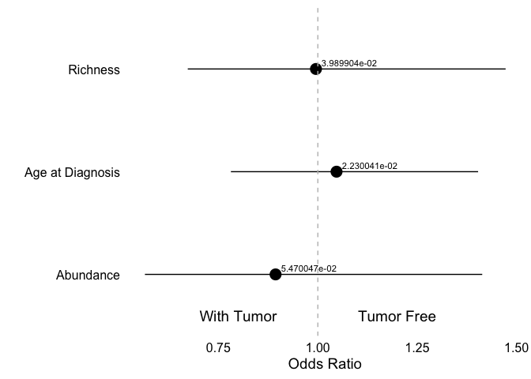
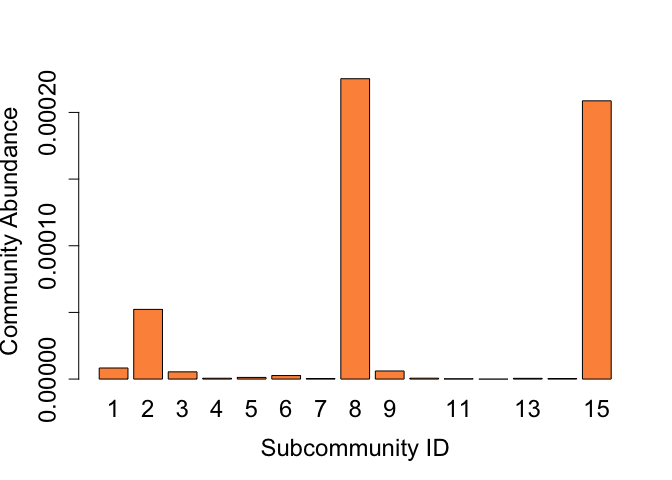

TCGA Cancer Microbiome Analysis Pipeline
================
2025-03-25

This notebook outlines a comprehensive pipeline for analyzing microbiome
data from The Cancer Genome Atlas (TCGA). It:

- **Loads Data**: Integrates microbiome OTU counts, metadata, clinical
  subtypes, immune profiles, and coverage statistics from TCGA, aligning
  sample identifiers across datasets.
- **Preprocessing**: Cleans and filters data, standardizing sample type
  labels for consistency.
- **Normalization**: Adjusts OTU counts using a coverage-based method to
  prepare data for analysis.
- **Clusters Samples**: Groups microbiome samples into “High” and “Low”
  categories based on species richness, abundance, or both, using
  quantile thresholds.
- **Determines Compositional Differences**: Applies ANCOM (Analysis of
  Composition of Microbiomes) to identify differentially abundant
  species between groups, with results visualized in volcano and bar
  plots.
- **Assesses Survival Differences**: Merges microbiome data with
  clinical survival information, fits Cox proportional hazards and
  nonlinear models, and generates survival plots with FDR-adjusted
  p-values for “Low” vs. “High” groups.
- **Modularity**: Utilizes helper functions for flexibility across TCGA
  cancer types, saving outputs (metadata, plots) to a specified
  directory.
- **Community Detection**: Determines co-occurring microbial communities
  within TCGA microbiome samples, selects species from these
  subcommunities for metabolic modeling, and infers metabolically
  mediated ecological interactions—specifically competition and
  mutualism. We correlate community richness and abundance with these
  interactions to uncover ecological dynamics.

``` r
# Load all relevant Libraries
library('survminer')      # Survival visualization
```

    ## Loading required package: ggplot2

    ## Loading required package: ggpubr

``` r
library("survival")       # Survival analysis
```

    ## 
    ## Attaching package: 'survival'

    ## The following object is masked from 'package:survminer':
    ## 
    ##     myeloma

``` r
library(ggplot2)          # Plotting
library("readxl")         # Excel file reading (unused here)
library(data.table)       # Fast data manipulation
library(gplots)           # Additional plotting tools
```

    ## 
    ## Attaching package: 'gplots'

    ## The following object is masked from 'package:stats':
    ## 
    ##     lowess

``` r
library(dplyr)            # Data wrangling
```

    ## 
    ## Attaching package: 'dplyr'

    ## The following objects are masked from 'package:data.table':
    ## 
    ##     between, first, last

    ## The following objects are masked from 'package:stats':
    ## 
    ##     filter, lag

    ## The following objects are masked from 'package:base':
    ## 
    ##     intersect, setdiff, setequal, union

``` r
library(gridExtra)        # Multi-plot layouts
```

    ## 
    ## Attaching package: 'gridExtra'

    ## The following object is masked from 'package:dplyr':
    ## 
    ##     combine

``` r
library(forcats)          # Categorical variable handling
library('flexsurv')       # Flexible survival models
library(ciTools)          # Confidence intervals for survival
```

    ## ciTools version 0.6.1 (C) Institute for Defense Analyses

``` r
library(lemon)            # Enhanced ggplot2 features
library(vegan)            # Ecological analysis (e.g., diversity)
```

    ## Loading required package: permute

    ## Loading required package: lattice

    ## This is vegan 2.6-4

``` r
library(MicrobiotaProcess) # Microbiome processing
```

    ## Registered S3 methods overwritten by 'treeio':
    ##   method              from    
    ##   MRCA.phylo          tidytree
    ##   MRCA.treedata       tidytree
    ##   Nnode.treedata      tidytree
    ##   Ntip.treedata       tidytree
    ##   ancestor.phylo      tidytree
    ##   ancestor.treedata   tidytree
    ##   child.phylo         tidytree
    ##   child.treedata      tidytree
    ##   full_join.phylo     tidytree
    ##   full_join.treedata  tidytree
    ##   groupClade.phylo    tidytree
    ##   groupClade.treedata tidytree
    ##   groupOTU.phylo      tidytree
    ##   groupOTU.treedata   tidytree
    ##   is.rooted.treedata  tidytree
    ##   nodeid.phylo        tidytree
    ##   nodeid.treedata     tidytree
    ##   nodelab.phylo       tidytree
    ##   nodelab.treedata    tidytree
    ##   offspring.phylo     tidytree
    ##   offspring.treedata  tidytree
    ##   parent.phylo        tidytree
    ##   parent.treedata     tidytree
    ##   root.treedata       tidytree
    ##   rootnode.phylo      tidytree
    ##   sibling.phylo       tidytree

    ## MicrobiotaProcess v1.10.3 For help:
    ## https://github.com/YuLab-SMU/MicrobiotaProcess/issues
    ## 
    ## If you use MicrobiotaProcess in published research, please cite the
    ## paper:
    ## 
    ## Shuangbin Xu, Li Zhan, Wenli Tang, Qianwen Wang, Zehan Dai, Land Zhou,
    ## Tingze Feng, Meijun Chen, Tianzhi Wu, Erqiang Hu, Guangchuang Yu.
    ## MicrobiotaProcess: A comprehensive R package for deep mining
    ## microbiome. The Innovation. 2023, 100388. doi:
    ## 10.1016/j.xinn.2023.100388
    ## 
    ## Export the citation to BibTex by citation('MicrobiotaProcess')
    ## 
    ## This message can be suppressed by:
    ## suppressPackageStartupMessages(library(MicrobiotaProcess))

    ## 
    ## Attaching package: 'MicrobiotaProcess'

    ## The following object is masked from 'package:ggpubr':
    ## 
    ##     get_coord

    ## The following object is masked from 'package:stats':
    ## 
    ##     filter

``` r
library(patchwork)        # Combine ggplot2 plots
library(stringr)          # String operations
library(compositions)     # Compositional data analysis (e.g., CLR)
```

    ## Welcome to compositions, a package for compositional data analysis.
    ## Find an intro with "? compositions"

    ## 
    ## Attaching package: 'compositions'

    ## The following objects are masked from 'package:stats':
    ## 
    ##     anova, cor, cov, dist, var

    ## The following object is masked from 'package:graphics':
    ## 
    ##     segments

    ## The following objects are masked from 'package:base':
    ## 
    ##     %*%, norm, scale, scale.default

``` r
library(phyloseq)         # Microbiome data structures
```

    ## 
    ## Attaching package: 'phyloseq'

    ## The following object is masked from 'package:MicrobiotaProcess':
    ## 
    ##     tax_table

``` r
library(ConQuR)           # Batch effect correction for microbiome
```

    ## Warning: replacing previous import 'ape::balance' by 'compositions::balance'
    ## when loading 'ConQuR'

    ## Warning: replacing previous import 'ape::where' by 'dplyr::where' when loading
    ## 'ConQuR'

    ## Warning: replacing previous import 'compositions::rmult' by 'glmnet::rmult'
    ## when loading 'ConQuR'

    ## Warning: replacing previous import 'dplyr::combine' by 'randomForest::combine'
    ## when loading 'ConQuR'

``` r
library(doParallel)       # Parallel processing
```

    ## Loading required package: foreach

    ## Loading required package: iterators

    ## Loading required package: parallel

``` r
library(DESeq2)           # Differential abundance analysis
```

    ## Loading required package: S4Vectors

    ## Loading required package: stats4

    ## Loading required package: BiocGenerics

    ## 
    ## Attaching package: 'BiocGenerics'

    ## The following objects are masked from 'package:compositions':
    ## 
    ##     normalize, var

    ## The following object is masked from 'package:gridExtra':
    ## 
    ##     combine

    ## The following objects are masked from 'package:dplyr':
    ## 
    ##     combine, intersect, setdiff, union

    ## The following objects are masked from 'package:stats':
    ## 
    ##     IQR, mad, sd, var, xtabs

    ## The following objects are masked from 'package:base':
    ## 
    ##     anyDuplicated, aperm, append, as.data.frame, basename, cbind,
    ##     colnames, dirname, do.call, duplicated, eval, evalq, Filter, Find,
    ##     get, grep, grepl, intersect, is.unsorted, lapply, Map, mapply,
    ##     match, mget, order, paste, pmax, pmax.int, pmin, pmin.int,
    ##     Position, rank, rbind, Reduce, rownames, sapply, setdiff, sort,
    ##     table, tapply, union, unique, unsplit, which.max, which.min

    ## 
    ## Attaching package: 'S4Vectors'

    ## The following object is masked from 'package:MicrobiotaProcess':
    ## 
    ##     rename

    ## The following objects are masked from 'package:dplyr':
    ## 
    ##     first, rename

    ## The following object is masked from 'package:gplots':
    ## 
    ##     space

    ## The following objects are masked from 'package:data.table':
    ## 
    ##     first, second

    ## The following objects are masked from 'package:base':
    ## 
    ##     expand.grid, I, unname

    ## Loading required package: IRanges

    ## 
    ## Attaching package: 'IRanges'

    ## The following object is masked from 'package:phyloseq':
    ## 
    ##     distance

    ## The following object is masked from 'package:MicrobiotaProcess':
    ## 
    ##     slice

    ## The following objects are masked from 'package:dplyr':
    ## 
    ##     collapse, desc, slice

    ## The following object is masked from 'package:data.table':
    ## 
    ##     shift

    ## Loading required package: GenomicRanges

    ## Loading required package: GenomeInfoDb

    ## Loading required package: SummarizedExperiment

    ## Loading required package: MatrixGenerics

    ## Loading required package: matrixStats

    ## 
    ## Attaching package: 'matrixStats'

    ## The following object is masked from 'package:dplyr':
    ## 
    ##     count

    ## 
    ## Attaching package: 'MatrixGenerics'

    ## The following objects are masked from 'package:matrixStats':
    ## 
    ##     colAlls, colAnyNAs, colAnys, colAvgsPerRowSet, colCollapse,
    ##     colCounts, colCummaxs, colCummins, colCumprods, colCumsums,
    ##     colDiffs, colIQRDiffs, colIQRs, colLogSumExps, colMadDiffs,
    ##     colMads, colMaxs, colMeans2, colMedians, colMins, colOrderStats,
    ##     colProds, colQuantiles, colRanges, colRanks, colSdDiffs, colSds,
    ##     colSums2, colTabulates, colVarDiffs, colVars, colWeightedMads,
    ##     colWeightedMeans, colWeightedMedians, colWeightedSds,
    ##     colWeightedVars, rowAlls, rowAnyNAs, rowAnys, rowAvgsPerColSet,
    ##     rowCollapse, rowCounts, rowCummaxs, rowCummins, rowCumprods,
    ##     rowCumsums, rowDiffs, rowIQRDiffs, rowIQRs, rowLogSumExps,
    ##     rowMadDiffs, rowMads, rowMaxs, rowMeans2, rowMedians, rowMins,
    ##     rowOrderStats, rowProds, rowQuantiles, rowRanges, rowRanks,
    ##     rowSdDiffs, rowSds, rowSums2, rowTabulates, rowVarDiffs, rowVars,
    ##     rowWeightedMads, rowWeightedMeans, rowWeightedMedians,
    ##     rowWeightedSds, rowWeightedVars

    ## Loading required package: Biobase

    ## Welcome to Bioconductor
    ## 
    ##     Vignettes contain introductory material; view with
    ##     'browseVignettes()'. To cite Bioconductor, see
    ##     'citation("Biobase")', and for packages 'citation("pkgname")'.

    ## 
    ## Attaching package: 'Biobase'

    ## The following object is masked from 'package:MatrixGenerics':
    ## 
    ##     rowMedians

    ## The following objects are masked from 'package:matrixStats':
    ## 
    ##     anyMissing, rowMedians

    ## The following object is masked from 'package:phyloseq':
    ## 
    ##     sampleNames

    ## Registered S3 method overwritten by 'httr':
    ##   method         from  
    ##   print.response rmutil

``` r
library(clusterProfiler)  # Enrichment analysis
```

    ## 

    ## clusterProfiler v4.6.2  For help: https://yulab-smu.top/biomedical-knowledge-mining-book/
    ## 
    ## If you use clusterProfiler in published research, please cite:
    ## T Wu, E Hu, S Xu, M Chen, P Guo, Z Dai, T Feng, L Zhou, W Tang, L Zhan, X Fu, S Liu, X Bo, and G Yu. clusterProfiler 4.0: A universal enrichment tool for interpreting omics data. The Innovation. 2021, 2(3):100141

    ## 
    ## Attaching package: 'clusterProfiler'

    ## The following object is masked from 'package:IRanges':
    ## 
    ##     slice

    ## The following object is masked from 'package:S4Vectors':
    ## 
    ##     rename

    ## The following object is masked from 'package:lattice':
    ## 
    ##     dotplot

    ## The following object is masked from 'package:stats':
    ## 
    ##     filter

``` r
library(org.Hs.eg.db)     # Human gene annotations
```

    ## Loading required package: AnnotationDbi

    ## 
    ## Attaching package: 'AnnotationDbi'

    ## The following object is masked from 'package:clusterProfiler':
    ## 
    ##     select

    ## The following object is masked from 'package:MicrobiotaProcess':
    ## 
    ##     select

    ## The following object is masked from 'package:dplyr':
    ## 
    ##     select

    ## 

``` r
library(AnnotationDbi)    # Annotation database interface
library(ggbeeswarm)       # Beeswarm plots
library(nlme)             # Linear mixed-effects models
```

    ## 
    ## Attaching package: 'nlme'

    ## The following object is masked from 'package:IRanges':
    ## 
    ##     collapse

    ## The following object is masked from 'package:dplyr':
    ## 
    ##     collapse

## Input Data: Microbiome, Immune and Clinical Data Integration for TCGA Analysis

This section integrates microbiome OTU counts, metadata, clinical
subtypes, immune data, and coverage statistics from the TCGA mycobiome
project. It aligns sample identifiers across datasets, cleans sample
type labels, and prepares the data for downstream analysis by matching
and reformatting key tables.

``` r
# Define base path for file inputs
PATH <- "/Users/eemanabbasi/Desktop/paper_2/thesis_project_second_microbiome_analysis/m_analysis/TCGA_analysis/mycobiome/Final_files/"

# Load microbiome OTU counts and metadata
counts <- read.csv(file.path(PATH, "TCGA_OTU.tsv"), sep = "\t", row.names = 1, check.names = FALSE)
qcMet <- read.csv(file.path(PATH, "metadata_species_WIS_overlapping_fungi_bacteria_12773samples.tsv"), sep = "\t", row.names = 1)

# Load and process clinical subtype data
subtype_clinical <- read.csv("/Users/eemanabbasi/Desktop/subtypes_clinical_data.tsv", sep = "\t", header = TRUE)
subtype_clinical <- subtype_clinical[!duplicated(rownames(subtype_clinical)), ]  # Remove duplicate rows
subtype_df <- data.frame(patient_id = subtype_clinical$Patient.ID, Subtype = subtype_clinical$Subtype)

# Match subtype data to metadata
matching_ids <- intersect(qcMet$tcga_case_id, subtype_clinical$Patient.ID)
matched_subtypes <- subset(subtype_clinical, Patient.ID %in% matching_ids)
qcMet$Subtype <- NA

# Assign subtypes to matching samples in metadata
for (id in matching_ids) {
  qcMet[qcMet$tcga_case_id == id & !is.na(qcMet$tcga_case_id), "Subtype"] <- matched_subtypes[matched_subtypes$Patient.ID == id, "Subtype"]
}

# Load taxonomy and immune data
tax <- read.table(file.path(PATH, "taxonomy_table_WIS_overlapping_fungi_bacteria.txt"), sep = "\t", row.names = 1)
immune_tcga <- read.table("/Users/eemanabbasi/Desktop/paper_2/thesis_project_second_microbiome_analysis/m_analysis/TCGA_analysis/tcga_immune/tcga_immune.txt", 
                          sep = "\t", encoding = "UTF-16", row.names = 1)

# Load and format coverage data
coverage <- read.table(file.path(PATH, "cgc_idxstats_mycobiome_all_total_reads_gdp_29Sep21.txt"), sep = "\t")
colnames(coverage) <- coverage[1, ]  # Set first row as headers
coverage <- coverage[-1, ]           # Remove header row

# Match coverage data to metadata
sample_name <- coverage[, 1]
matched_sample_names <- coverage[sample_name %in% qcMet$filename, ]
matched_qcMet <- qcMet[qcMet$filename %in% sample_name, ]
qcMet <- cbind(matched_qcMet, matched_sample_names[, -1])  # Merge coverage stats

# Clean immune data column names
col_names <- as.character(immune_tcga[1, ])
colnames(immune_tcga) <- col_names
immune_tcga <- immune_tcga[-1, ]
colnames(immune_tcga) <- gsub(" ", "_", colnames(immune_tcga))  # Replace spaces with underscores

# Functions to standardize sample type labels
replace_tissue_normal <- function(sample_type) gsub("Solid Tissue Normal", "Normal", sample_type)
replace_blood_normal <- function(sample_type) gsub("Blood Derived Normal", "Normal", sample_type)
replace_tissue_tumor <- function(sample_type) gsub("Recurrent Tumor", "Tumor", sample_type)
replace_met_tumor <- function(sample_type) gsub("Metastatic", "Tumor", sample_type)
replace_tumor <- function(sample_type) gsub("Primary Tumor", "Tumor", sample_type)
replace_add_tumor <- function(sample_type) gsub("Additional - New Primary Tumor", "Tumor", sample_type)

# Apply label standardization to metadata
qcMet$sample_type <- replace_tissue_normal(qcMet$sample_type)
qcMet$sample_type <- replace_blood_normal(qcMet$sample_type)
qcMet$sample_type <- replace_tissue_tumor(qcMet$sample_type)
qcMet$sample_type <- replace_met_tumor(qcMet$sample_type)
qcMet$sample_type <- replace_tumor(qcMet$sample_type)
qcMet$sample_type <- replace_add_tumor(qcMet$sample_type)

# qcMet <- qcMet[qcMet$sample_type != "Recurrent Tumor", ]

# Align counts and taxonomy with metadata
colnames(counts) <- rownames(qcMet)
colnames(tax) <- c("Domain", "Phylum", "Class", "Order", "Family", "Genus", "Species")
tax <- tax[match(rownames(counts), rownames(tax)), ]  # Match taxonomy to OTU rows
```

## Cancer Microbiome Data Processing and Clustering

This section provides helper functions to process TCGA microbiome data
for any cancer type, normalize it using CLR or coverage-based methods,
and cluster patient samples based on species richness, abundance, or
both. It filters and prepares data for downstream analysis.

The script also generates and save scatter plots for TCGA microbiome
data, visualizing species richness and log-transformed abundance across
samples for a specified cancer type and state. Plots include variations
with shipping center colors and quantile-based grouping.

``` r
# Extract samples for a specific cancer type and state
get_samples <- function(cancer_name, state) {
  qcMet['SampleID'] <- rownames(qcMet)  # Add SampleID column
  
  # Filter metadata by cancer, state, and exclude specific source
  filtered_samples <- qcMet %>%
    filter(data_submitting_center_label != "University of North Carolina", investigation == cancer_name, sample_type == state)
  
  # Filter OTU counts based on matching samples
  matching_row_names <- colnames(counts) %in% filtered_samples$SampleID
  counts_filt <- counts[matching_row_names]
  counts_filt <- counts_filt[rowSums(counts_filt) >= 500, ]  # Remove low-abundance taxa
  counts_filt <- counts_filt[, colSums(counts_filt) > 0]     # Remove zero-sum samples
  
  # Filter taxonomy and immune data
  matching_row_names <- rownames(counts_filt) %in% rownames(tax)
  tax_filt <- tax[matching_row_names, ]
  matching_index <- which(rownames(immune_tcga) %in% filtered_samples$tcga_case_id)
  immune_tcga_filt <- immune_tcga[matching_index, ]
  
  # Create phyloseq objects (raw and processed)
  otda <- as.matrix.data.frame(counts_filt)
  OTU <- phyloseq::otu_table(otda, taxa_are_rows = TRUE)
  tax_t <- as.matrix.data.frame(tax_filt)
  taxda <- phyloseq::tax_table(tax_t)
  sample <- phyloseq::sample_data(filtered_samples)
  ps_tumor_raw <- phyloseq::phyloseq(OTU, sample, taxda)
  ps_tumor <- phyloseq::phyloseq(OTU, sample, taxda)
  sample_ids <- names(counts_filt)
  
  # Return list of outputs
  return(c(ps_tumor_raw = ps_tumor_raw, ps_tumor = ps_tumor, filtered_samples = filtered_samples, 
           sample_ids = sample_ids, tax_filt = tax_filt))
}

# Normalize phyloseq object using CLR transformation
normalize_ps <- function(ps_tumor) {
  cts <- ps_tumor@otu_table
  sample_totals <- colSums(cts)
  relative_abundance <- cts / sample_totals
  xt <- clr(relative_abundance)  # Centered log-ratio transform
  OTU <- phyloseq::otu_table(xt, taxa_are_rows = TRUE)
  sample <- phyloseq::sample_data(ps_tumor@sam_data)
  taxTable <- phyloseq::tax_table(ps_tumor@tax_table)
  return(phyloseq::phyloseq(OTU, sample, taxTable))
}

# Normalize phyloseq object using coverage data
normalize_ps_coverage <- function(ps_tumor) {
  cts <- ps_tumor@otu_table
  coverage <- as.numeric(ps_tumor@sam_data$total)  # Use total reads for normalization
  relative_abundance <- cts / coverage
  xt <- relative_abundance  # No log transform here
  print("log has been taken")  # Note: Misleading message, no log applied
  OTU <- phyloseq::otu_table(xt, taxa_are_rows = TRUE)
  sample <- phyloseq::sample_data(ps_tumor@sam_data)
  taxTable <- phyloseq::tax_table(ps_tumor@tax_table)
  return(phyloseq::phyloseq(OTU, sample, taxTable))
}

# Prepare data frame for plotting richness and abundance
plot_data_df <- function(ps_clr) {
  tumor_counts <- phyloseq::otu_table(ps_clr)
  observed_richness <- colSums(tumor_counts > 0)  # Species richness
  if (!is.null(ps_clr@sam_data$Group)) {
    plot_data <- data.frame(species_richness = observed_richness, CLR_abundance = log(colSums(tumor_counts)), 
                            shipping_labels = ps_clr@sam_data$data_submitting_center_label, Group = ps_clr@sam_data$Group)
  } else {
    plot_data <- data.frame(species_richness = observed_richness, CLR_abundance = log(colSums(tumor_counts)), 
                            shipping_labels = ps_clr@sam_data$data_submitting_center_label)
    phyloseq::sample_data(ps_clr)$microbiome_richness <- colSums(tumor_counts > 0)
    phyloseq::sample_data(ps_clr)$microbiome_abundance <- log(colSums(tumor_counts))
  }
  return(c(list(plot_data = plot_data, ps_clr = ps_clr)))
}

# Cluster samples by abundance only
assign_groups_abundance <- function(plot_data, ps_tumor_clr) {
  # Define low and high abundance groups based on quantiles
  samples_in_low_richness <- plot_data[plot_data$CLR_abundance < quantile(plot_data$CLR_abundance, prob = 0.25), ]
  samples_in_high_richness <- plot_data[plot_data$CLR_abundance > quantile(plot_data$CLR_abundance, prob = 0.75), ]
  
  # Label groups
  samples_in_low_richness$QuantileLabel <- "Low"
  samples_in_high_richness$QuantileLabel <- "High"
  not_used_samples <- plot_data[!(row.names(plot_data) %in% row.names(samples_in_low_richness) | 
                                    row.names(plot_data) %in% row.names(samples_in_high_richness)), ]
  not_used_samples$QuantileLabel <- "not_used_samples"
  
  # Combine and align with phyloseq object
  combined_samples <- rbind(samples_in_low_richness, samples_in_high_richness, not_used_samples)
  combined_samples_reordered <- combined_samples[rownames(phyloseq::sample_data(ps_tumor_clr)), ]
  phyloseq::sample_data(ps_tumor_clr)$Group <- combined_samples_reordered$QuantileLabel
  
  # Add richness and abundance to sample data
  ps_sample_names <- rownames(phyloseq::sample_data(ps_tumor_clr))
  ordered_plot_data <- plot_data[match(ps_sample_names, rownames(plot_data)), ]
  phyloseq::sample_data(ps_tumor_clr)$Microbiome_Richness <- ordered_plot_data$species_richness
  phyloseq::sample_data(ps_tumor_clr)$Microbiome_Abundance <- ordered_plot_data$CLR_abundance
  
  return(list(ps_tumor_clr = ps_tumor_clr, combined_samples = combined_samples_reordered))
}

# Cluster samples by richness only
assign_groups_richness <- function(plot_data, ps_tumor_clr) {
  # Define low and high richness groups based on quantiles
  samples_in_low_richness <- plot_data[plot_data$species_richness < quantile(plot_data$species_richness, prob = 0.25), ]
  samples_in_high_richness <- plot_data[plot_data$species_richness > quantile(plot_data$species_richness, prob = 0.75), ]
  
  # Label groups
  samples_in_low_richness$QuantileLabel <- "Low"
  samples_in_high_richness$QuantileLabel <- "High"
  not_used_samples <- plot_data[!(row.names(plot_data) %in% row.names(samples_in_low_richness) | 
                                    row.names(plot_data) %in% row.names(samples_in_high_richness)), ]
  not_used_samples$QuantileLabel <- "not_used_samples"
  
  # Combine and align with phyloseq object
  combined_samples <- rbind(samples_in_low_richness, samples_in_high_richness, not_used_samples)
  combined_samples_reordered <- combined_samples[rownames(phyloseq::sample_data(ps_tumor_clr)), ]
  phyloseq::sample_data(ps_tumor_clr)$Group <- combined_samples_reordered$QuantileLabel
  
  # Add richness and abundance to sample data
  ps_sample_names <- rownames(phyloseq::sample_data(ps_tumor_clr))
  ordered_plot_data <- plot_data[match(ps_sample_names, rownames(plot_data)), ]
  phyloseq::sample_data(ps_tumor_clr)$Microbiome_Richness <- ordered_plot_data$species_richness
  phyloseq::sample_data(ps_tumor_clr)$Microbiome_Abundance <- ordered_plot_data$CLR_abundance
  
  return(list(ps_tumor_clr = ps_tumor_clr, combined_samples = combined_samples_reordered))
}

# Cluster samples by both richness and abundance
assign_groups_richness_abundance <- function(plot_data, ps_tumor_clr) {
  # Define low and high groups based on both richness and abundance quantiles
  samples_in_low_richness <- plot_data[plot_data$species_richness < quantile(plot_data$species_richness, prob = 0.25) & 
                                         plot_data$CLR_abundance < quantile(plot_data$CLR_abundance, prob = 0.25), ]
  samples_in_high_richness <- plot_data[plot_data$species_richness > quantile(plot_data$species_richness, prob = 0.75) & 
                                          plot_data$CLR_abundance > quantile(plot_data$CLR_abundance, prob = 0.75), ]
  
  # Label groups
  samples_in_low_richness$QuantileLabel <- "Low"
  samples_in_high_richness$QuantileLabel <- "High"
  not_used_samples <- plot_data[!(row.names(plot_data) %in% row.names(samples_in_low_richness) | 
                                    row.names(plot_data) %in% row.names(samples_in_high_richness)), ]
  not_used_samples$QuantileLabel <- "not_used_samples"
  
  # Combine and align with phyloseq object
  combined_samples <- rbind(samples_in_low_richness, samples_in_high_richness, not_used_samples)
  combined_samples_reordered <- combined_samples[rownames(phyloseq::sample_data(ps_tumor_clr)), ]
  phyloseq::sample_data(ps_tumor_clr)$Group <- combined_samples_reordered$QuantileLabel
  
  # Add richness and abundance to sample data
  ps_sample_names <- rownames(phyloseq::sample_data(ps_tumor_clr))
  ordered_plot_data <- plot_data[match(ps_sample_names, rownames(plot_data)), ]
  phyloseq::sample_data(ps_tumor_clr)$Microbiome_Richness <- ordered_plot_data$species_richness
  phyloseq::sample_data(ps_tumor_clr)$Microbiome_Abundance <- ordered_plot_data$CLR_abundance
  
  return(list(ps_tumor_clr = ps_tumor_clr, combined_samples = combined_samples_reordered))
}

# Cluster samples randomly for control comparison
assign_groups_random <- function(plot_data, ps_tumor_clr) {
  # Shuffle data for random assignment
  shuffled_data <- plot_data[sample(nrow(plot_data)), ]
  total_samples <- nrow(shuffled_data)
  low_high_samples <- floor(total_samples * 0.4)  # 40% split for low/high
  not_used_samples_count <- total_samples - (2 * low_high_samples)
  
  # Randomly select low and high groups
  low_richness_samples <- shuffled_data[sample(nrow(shuffled_data), size = low_high_samples), ]
  high_richness_samples <- shuffled_data[!(rownames(shuffled_data) %in% row.names(low_richness_samples)), ][
    sample(nrow(shuffled_data) - nrow(low_richness_samples), size = low_high_samples), ]
  
  # Handle remaining samples
  not_used_samples_df <- shuffled_data[!(rownames(shuffled_data) %in% row.names(low_richness_samples) | 
                                           rownames(shuffled_data) %in% row.names(high_richness_samples)), ]
  if (nrow(not_used_samples_df) > not_used_samples_count) {
    not_used_samples_df <- not_used_samples_df[sample(nrow(not_used_samples_df), size = not_used_samples_count), ]
  }
  
  # Label groups
  low_richness_samples$QuantileLabel <- "Low"
  high_richness_samples$QuantileLabel <- "High"
  not_used_samples_df$QuantileLabel <- "Not Used"
  
  # Combine and align with phyloseq object
  combined_samples <- rbind(low_richness_samples, high_richness_samples, not_used_samples_df)
  combined_samples_reordered <- combined_samples[rownames(phyloseq::sample_data(ps_tumor_clr)), ]
  phyloseq::sample_data(ps_tumor_clr)$Group <- combined_samples_reordered$QuantileLabel
  
  return(list(ps_tumor_clr = ps_tumor_clr, combined_samples = combined_samples))
}

# Filter phyloseq objects to keep only High/Low groups
filtered_ps <- function(ps_tumor_clr, ps_tumor_raw) {
  ps_tumor_filtered <- subset_samples(ps_tumor_clr, Group %in% c("High", "Low"))
  sample_data(ps_tumor_raw)$Group <- sample_data(ps_tumor_clr)$Group
  ps_tumor_raw <- subset_samples(ps_tumor_raw, Group %in% c("High", "Low"))
  return(c(ps_tumor_filtered = ps_tumor_filtered, ps_tumor_raw = ps_tumor_raw))
}


# Generate richness and abundance plots for a cancer type and state
generate_richness_abundance_plots <- function(cancer_name, state, path_to_save) {
  # Define color mapping for shipping centers
  color_mapping <- c(
    "Washington University School of Medicine" = "#66c2a5",        # Greenish Blue
    "Broad Institute of MIT and Harvard" = "#fc8d62",             # Salmon
    "Baylor College of Medicine" = "#8da0cb",                     # Light Blue
    "Harvard Medical School" = "#e78ac3",                        # Pinkish
    "MD Anderson - Institute for Applied Cancer Science" = "#a6d854", # Light Green
    "MD Anderson - RPPA Core Facility (Proteomics)" = "#ffd92f",  # Yellow
    "University of North Carolina" = "#e5c494",                   # Beige
    "Canada's Michael Smith Genome Sciences Centre" = "#b3b3b3"   # Gray
  )
  
  # Basic richness vs. abundance scatter plot
  richness_abundnace <- ggplot(plot_data$plot_data, aes(x = species_richness, y = CLR_abundance)) +
    geom_point(size = 4, show.legend = TRUE) +  # Scatter points
    theme_bw() +
    theme(panel.grid = element_blank()) +
    labs(x = "Observed Richness", y = "log(Abundance)") +
    theme(
      plot.title = element_text(size = 14, face = "bold"),
      axis.title = element_text(size = 14),
      axis.text = element_text(size = 12),
      legend.title = element_blank(),
      legend.text = element_text(size = 14)
    )
  
  # Save the basic plot
  filepath <- paste0(path_to_save, "richabun_", cancer_name, "_", state, "_plot.pdf")
  ggsave(filepath, richness_abundnace, device = "pdf", width = 8, height = 6, units = "in")
  
  # Richness vs. abundance with shipping center colors
  richness_abundnace_gplot <- ggplot(plot_data$plot_data, aes(x = species_richness, y = CLR_abundance, color = shipping_labels)) +
    geom_point(size = 4, show.legend = TRUE) +
    theme_bw() +
    theme(panel.grid = element_blank()) +
    scale_color_manual(values = color_mapping) +  # Apply color mapping
    labs(x = "Observed Richness", y = "log(Abundance)") +
    theme(
      plot.title = element_text(size = 14, face = "bold"),
      axis.title = element_text(size = 14),
      axis.text = element_text(size = 12),
      legend.title = element_blank(),
      legend.text = element_text(size = 14)
    )
  
  # Save the colored plot
  filepath <- paste0(path_to_save, "richness_abundnace_", cancer_name, "_", state, "_gplot.pdf")
  ggsave(filepath, richness_abundnace_gplot, device = "pdf", width = 8, height = 6, units = "in")
  
  # Quantile-based richness vs. abundance plot
  quantile_plot <- ggplot(as_out$combined_samples, aes(x = species_richness, y = CLR_abundance, color = QuantileLabel)) +
    geom_point(size = 4) +
    geom_point(data = as_out$combined_samples[as_out$combined_samples$QuantileLabel == "not_used_samples", ], 
               aes(x = species_richness, y = CLR_abundance), size = 3, shape = 1, color = "gray") +  # Highlight unused samples
    scale_color_manual(values = c("Low" = "#FD9347", "High" = "#00AED7", "not_used_samples" = "gray"), 
                       breaks = c("Low", "High"), name = "Quantiles") +  # Custom colors and legend
    theme_bw() +
    theme(panel.grid = element_blank(), 
          plot.title = element_text(size = 14, face = "bold"),
          axis.title = element_text(size = 16),
          axis.text = element_text(size = 12),
          legend.title = element_blank(),
          legend.text = element_text(size = 14)) +
    labs(x = "Observed Richness", y = "log(Abundance)")
  
  # Save the quantile plot
  filepath <- paste0(path_to_save, "quantile_", cancer_name, "_", state, "_plot.pdf")
  ggsave(filepath, quantile_plot, device = "pdf", width = 8, height = 6, units = "in")
}
```

## Differential Species Analysis with ANCOM

This section provides an ANCOM helper function for preprocessing
microbiome data and identifying differentially abundant taxa, followed
by a function that applies ANCOM to TCGA data, generates plots (volcano
and bar charts), and highlights significant species across sample
groups.

``` r
# Pre-process feature table for ANCOM analysis
feature_table_pre_process <- function(feature_table, meta_data, sample_var, group_var = NULL, 
                                      out_cut = 0.05, zero_cut = 0.90, lib_cut, neg_lb) {
  # Convert to data frames and align sample IDs
  feature_table <- data.frame(feature_table, check.names = FALSE)
  meta_data <- data.frame(meta_data, check.names = FALSE)
  meta_data[] <- lapply(meta_data, function(x) if(is.factor(x)) factor(x) else x)  # Drop unused levels
  sample_ID <- intersect(meta_data[, sample_var], colnames(feature_table))
  feature_table <- feature_table[, sample_ID]
  meta_data <- meta_data[match(sample_ID, meta_data[, sample_var]), ]
  
  # Identify and remove outliers if grouped
  if (!is.null(group_var)) {
    group <- meta_data[, group_var]
    z <- feature_table + 1
    f <- log(z); f[f == 0] <- NA
    f <- colMeans(f, na.rm = TRUE)
    f_fit <- lm(f ~ group)
    e <- rep(0, length(f)); e[!is.na(group)] <- residuals(f_fit)
    y <- t(t(z) - e)
    
    # Outlier detection with mixture model
    outlier_check <- function(x) {
      mu1 <- quantile(x, 0.25, na.rm = TRUE); mu2 <- quantile(x, 0.75, na.rm = TRUE)
      sigma1 <- mu2 - mu1; sigma2 <- sigma1; pi <- 0.75; n <- length(x)
      epsilon <- 100; tol <- 1e-5
      score <- pi * dnorm(x, mu1, sigma1) / ((1 - pi) * dnorm(x, mu2, sigma2))
      while (epsilon > tol) {
        grp1_ind <- (score >= 1)
        mu1_new <- mean(x[grp1_ind]); mu2_new <- mean(x[!grp1_ind])
        sigma1_new <- sd(x[grp1_ind]); if(is.na(sigma1_new)) sigma1_new <- 0
        sigma2_new <- sd(x[!grp1_ind]); if(is.na(sigma2_new)) sigma2_new <- 0
        pi_new <- sum(grp1_ind) / n
        if (any(is.na(c(mu1_new, mu2_new, sigma1_new, sigma2_new, pi_new)))) break
        score <- pi_new * dnorm(x, mu1_new, sigma1_new) / ((1 - pi_new) * dnorm(x, mu2_new, sigma2_new))
        epsilon <- sqrt(sum((c(mu1, mu2, sigma1, sigma2, pi) - c(mu1_new, mu2_new, sigma1_new, sigma2_new, pi_new))^2))
        mu1 <- mu1_new; mu2 <- mu2_new; sigma1 <- sigma1_new; sigma2 <- sigma2_new; pi <- pi_new
      }
      if (mu1 + 1.96 * sigma1 < mu2 - 1.96 * sigma2) {
        if (pi < out_cut) return(grp1_ind)
        else if (pi > 1 - out_cut) return(!grp1_ind)
        else return(rep(FALSE, n))
      } else return(rep(FALSE, n))
    }
    out_ind <- matrix(FALSE, nrow(feature_table), ncol(feature_table))
    out_ind[, !is.na(group)] <- t(apply(y, 1, function(i) unlist(tapply(i, group, outlier_check))))
    feature_table[out_ind] <- NA
  }
  
  # Filter taxa and samples
  zero_prop <- apply(feature_table, 1, function(x) sum(x == 0, na.rm = TRUE) / length(x[!is.na(x)]))
  taxa_del <- which(zero_prop >= zero_cut)
  if (length(taxa_del) > 0) feature_table <- feature_table[-taxa_del, ]
  lib_size <- colSums(feature_table, na.rm = TRUE)
  if (any(lib_size < lib_cut)) {
    subj_del <- which(lib_size < lib_cut)
    feature_table <- feature_table[, -subj_del]
    meta_data <- meta_data[-subj_del, ]
  }
  
  # Identify structural zeros if grouped
  if (!is.null(group_var)) {
    group <- factor(meta_data[, group_var])
    present_table <- as.matrix(feature_table); present_table[is.na(present_table)] <- 0; present_table[present_table != 0] <- 1
    p_hat <- t(apply(present_table, 1, function(x) unlist(tapply(x, group, mean, na.rm = TRUE))))
    samp_size <- t(apply(feature_table, 1, function(x) unlist(tapply(x, group, function(y) length(y[!is.na(y)])))))
    p_hat_lo <- p_hat - 1.96 * sqrt(p_hat * (1 - p_hat) / samp_size)
    struc_zero <- (p_hat == 0) * 1
    if (neg_lb) struc_zero[p_hat_lo <= 0] <- 1
    struc_ind <- struc_zero[, group]
    feature_table <- feature_table * (1 - struc_ind)
    colnames(struc_zero) <- paste0("structural_zero (", colnames(struc_zero), ")")
  } else {
    struc_zero <- NULL
  }
  
  return(list(feature_table = feature_table, meta_data = meta_data, structure_zeros = struc_zero))
}

# ANCOM: Analysis of Composition of Microbiomes
ANCOM <- function(feature_table, meta_data, struc_zero = NULL, main_var, p_adj_method = "BH", 
                  alpha = 0.05, adj_formula = NULL, rand_formula = NULL, lme_control = NULL) {
  # Preprocess OTU table for ANCOM
  if (!is.null(struc_zero)) {
    num_struc_zero <- apply(struc_zero, 1, sum)
    comp_table <- feature_table[num_struc_zero == 0, ]
  } else {
    comp_table <- feature_table
  }
  comp_table <- log(as.matrix(comp_table) + 1)  # Log transform with pseudocount
  n_taxa <- dim(comp_table)[1]; taxa_id <- rownames(comp_table); n_samp <- dim(comp_table)[2]
  
  # Select statistical test
  if (is.null(rand_formula) & is.null(adj_formula)) {
    tfun <- if (length(unique(meta_data %>% pull(main_var))) == 2) stats::wilcox.test else stats::kruskal.test
    tformula <- formula(paste("x ~", main_var))
  } else if (is.null(rand_formula) & !is.null(adj_formula)) {
    tfun <- stats::aov
    tformula <- formula(paste("x ~", main_var, "+", adj_formula))
  } else if (!is.null(rand_formula)) {
    tfun <- nlme::lme
    tformula <- if (is.null(adj_formula)) formula(paste("x ~", main_var)) else formula(paste("x ~", main_var, "+", adj_formula))
  }
  
  # Compute p-values for taxon pairs
  p_data <- matrix(NA, n_taxa, n_taxa, dimnames = list(taxa_id, taxa_id))
  #pb <- txtProgressBar(0, n_taxa - 1, style = 3)
  for (i in 1:(n_taxa - 1)) {
    #setTxtProgressBar(pb, i)
    alr_data <- apply(comp_table, 1, function(x) x - comp_table[i, ])[, -(1:i), drop = FALSE]
    n_lr <- dim(alr_data)[2]
    alr_data <- cbind(alr_data, meta_data)
    if (is.null(rand_formula) & is.null(adj_formula)) {
      p_data[-(1:i), i] <- apply(alr_data[, 1:n_lr, drop = FALSE], 2, function(x) {
        suppressWarnings(tfun(tformula, data = data.frame(x, alr_data, check.names = FALSE))$p.value)
      })
    } else if (is.null(rand_formula) & !is.null(adj_formula)) {
      p_data[-(1:i), i] <- apply(alr_data[, 1:n_lr, drop = FALSE], 2, function(x) {
        summary(tfun(tformula, data = data.frame(x, alr_data, check.names = FALSE), na.action = na.omit))[[1]][main_var, "Pr(>F)"]
      })
    } else if (!is.null(rand_formula)) {
      p_data[-(1:i), i] <- apply(alr_data[, 1:n_lr, drop = FALSE], 2, function(x) {
        fit <- try(tfun(fixed = tformula, data = data.frame(x, alr_data, check.names = FALSE), random = formula(rand_formula), 
                        na.action = na.omit, control = lme_control), silent = TRUE)
        if (inherits(fit, "try-error")) NA else anova(fit)[main_var, "p-value"]
      })
    }
  }
  #close(pb)
  
  # Finalize p-value matrix and adjust
  p_data[upper.tri(p_data)] <- t(p_data)[upper.tri(p_data)]
  diag(p_data) <- 1; p_data[is.na(p_data)] <- 1
  q_data <- apply(p_data, 2, function(x) p.adjust(x, method = p_adj_method))
  W <- apply(q_data, 2, function(x) sum(x < alpha))  # W statistic
  
  # Organize output
  out_comp <- data.frame(taxa_id, W, row.names = NULL, check.names = FALSE) %>%
    mutate(detected_0.9 = W > 0.9 * (n_taxa - 1), detected_0.8 = W > 0.8 * (n_taxa - 1),
           detected_0.7 = W > 0.7 * (n_taxa - 1), detected_0.6 = W > 0.6 * (n_taxa - 1))
  if (!is.null(struc_zero)) {
    out <- data.frame(taxa_id = rownames(struc_zero), W = Inf, detected_0.9 = TRUE, 
                      detected_0.8 = TRUE, detected_0.7 = TRUE, detected_0.6 = TRUE, 
                      row.names = NULL, check.names = FALSE)
    out[match(taxa_id, out$taxa_id), ] <- out_comp
  } else {
    out <- out_comp
  }
  
  # Volcano plot with CLR differences
  clr_table <- apply(feature_table, 2, clr)
  eff_size <- apply(clr_table, 1, function(y) lm(y ~ x, data = data.frame(y = y, x = meta_data %>% pull(main_var), check.names = FALSE))$coef[-1])
  if (is.matrix(eff_size)) {
    dat_fig <- data.frame(taxa_id = out$taxa_id, t(eff_size), y = out$W, check.names = FALSE) %>% 
      mutate(zero_ind = factor(ifelse(is.infinite(y), "Yes", "No"), levels = c("Yes", "No"))) %>%
      gather(key = group, value = x, rownames(eff_size))
    dat_fig$group <- sapply(dat_fig$group, function(x) gsub("x", paste0(main_var, " = "), x))
    dat_fig$y <- replace(dat_fig$y, is.infinite(dat_fig$y), n_taxa - 1)
    fig <- ggplot(dat_fig, aes(x = x, y = y)) + 
      geom_point(aes(color = zero_ind)) + facet_wrap(~ group) +
      labs(x = "CLR mean difference", y = "W statistic") +
      scale_color_discrete(name = "Structural zero", drop = FALSE) + 
      theme_bw() + theme(plot.title = element_text(hjust = 0.5), legend.position = "top", strip.background = element_rect(fill = "white"))
  } else {
    dat_fig <- data.frame(taxa_id = out$taxa_id, x = eff_size, y = out$W) %>% 
      mutate(zero_ind = factor(ifelse(is.infinite(y), "Yes", "No"), levels = c("Yes", "No")))
    dat_fig$y <- replace(dat_fig$y, is.infinite(dat_fig$y), n_taxa - 1)
    fig <- ggplot(dat_fig, aes(x = x, y = y)) + 
      geom_point(aes(color = zero_ind)) + 
      labs(x = "CLR mean difference", y = "W statistic") +
      scale_color_discrete(name = "Structural zero", drop = FALSE) + 
      theme_bw() + theme(plot.title = element_text(hjust = 0.5), legend.position = "top")
  }
  
  return(list(p_data = p_data, q_data = q_data, out = out, fig = fig))
}

# Cancer-specific ANCOM analysis
run_ancomb <- function(ps_tumor_raw, cancer_name, state, path_to_save) {
  # Extract OTU table and metadata from phyloseq object
  otu_os <- ps_tumor_raw@otu_table
  sample_df <- ps_tumor_raw@sam_data
  sample_df['sample_id'] <- rownames(ps_tumor_raw@sam_data)
  
  # Preprocess data for ANCOM
  feature_table <- otu_os; sample_var <- "sample_id"; group_var <- NULL
  out_cut <- 0.05; zero_cut <- 0.90; lib_cut <- 1000; neg_lb <- FALSE
  prepro <- feature_table_pre_process(feature_table, sample_df, sample_var, group_var, out_cut, zero_cut, lib_cut, neg_lb)
  feature_table <- prepro$feature_table
  meta_data <- prepro$meta_data
  struc_zero <- prepro$structure_zeros
  
  # Set ANCOM parameters
  main_var <- "Group"; p_adj_method <- "BH"; alpha <- 0.05
  adj_formula <- if (length(unique(sample_df$data_submitting_center_label)) == 1) "age_at_diagnosis" else 
    "data_submitting_center_label + age_at_diagnosis + gender"
  rand_formula <- NULL; lme_control <- NULL
  
  # Run ANCOM
  res <- ANCOM(feature_table, meta_data, struc_zero, main_var, p_adj_method, alpha, adj_formula, rand_formula, lme_control)
  
  # Calculate cutoffs for differential abundance
  n_taxa <- ifelse(is.null(struc_zero), nrow(feature_table), sum(apply(struc_zero, 1, sum) == 0))
  cut_off <- c(0.9 * (n_taxa - 1), 0.8 * (n_taxa - 1), 0.7 * (n_taxa - 1), 0.6 * (n_taxa - 1))
  names(cut_off) <- c("detected_0.9", "detected_0.8", "detected_0.7", "detected_0.6")
  
  # Extract significant species
  detected_sp_index <- which(res$out$detected_0.9 == TRUE)
  detected_species <- res$out$taxa_id[detected_sp_index]
  extract_clr <- res$fig$data$x[detected_sp_index]
  detected_W <- res$out$W[detected_sp_index]
  color_list <- ifelse(extract_clr > 0, "Low", ifelse(extract_clr < 0, "High", "not_used"))
  
  # Enhance volcano plot with annotations
  dat_ann <- data.frame(x = min(res$fig$data$x), y = cut_off["detected_0.9"], label = "W[0.9]")
  dat_sp_id <- data.frame(x = extract_clr, y = detected_W, label = detected_species, Group = color_list)
  fig <- res$fig + 
    geom_hline(yintercept = cut_off["detected_0.9"], linetype = "dashed") + 
    geom_text(data = dat_ann, aes(x = x, y = y, label = label), size = 4, vjust = -0.5, hjust = 0, color = "orange", parse = TRUE) +
    geom_vline(xintercept = 0, linetype = "dashed") +
    geom_text(data = dat_sp_id, aes(x = x, y = y, label = label), size = 2, box.padding = 0.5, color = "black") +
    geom_vline(xintercept = 0, linetype = "dashed") +
    theme(panel.grid = element_blank())
  
  # Save volcano plot
  filepath <- paste0(path_to_save, "ancomb_w_statistic", state, "_plot.jpeg")
  ggsave(filepath, fig, device = "jpeg", width = 8, height = 6, units = "in")
  
  # Bar plot for significant species
  top_extreme_species <- dat_sp_id[order(abs(dat_sp_id$y)), ][1:length(dat_sp_id$label), ]
  top_extreme_species <- top_extreme_species[(abs(top_extreme_species$x) > 0), ]
  top_extreme_species$label <- str_replace(top_extreme_species$label, "_", " ")
  binary_palette <- c("#8E7CC3", "#6B8E6E")  # Purple and Green
  
  clr_plot <- ggplot(top_extreme_species, aes(x = x, y = reorder(label, x), fill = Group)) +
    geom_bar(stat = "identity", width = 0.7) +
    scale_fill_manual(values = binary_palette) +
    labs(x = "CLR Mean Difference", y = "Species") +
    ggtitle("") +
    theme_minimal() +
    theme(panel.grid = element_blank(), axis.text.y = element_text(size = 12), axis.text.x = element_text(size = 14),
          axis.title = element_text(size = 14), axis.ticks.x = element_line(size = 0.2), 
          plot.margin = margin(10, 50, 10, 30, "pt"))
  
  # Save bar plot
  print(clr_plot)
  filepath <- paste0(path_to_save, "ancomb_clr_species", state, "_plot.pdf")
  ggsave(filepath, clr_plot, device = "pdf", width = 8, height = 6, units = "in", dpi = 300)
  
  return(top_extreme_species)
}
```

## Main TCGA Cancer Microbiome Analysis Workflow

This script leverages helper functions from above, providing flexibility
across cancer types. It processes TCGA microbiome data for all cancer
types, normalizes it, clusters samples based on richness and abundance,
performs differential abundance analysis (ANCOM), and conducts survival
analysis.

``` r
# Load required libraries 
library(phyloseq)      # Phyloseq objects
library(dplyr)         # Data manipulation
library(stringr)       # String operations
library(survival)      # Survival analysis
library(survminer)     # Survival plotting
library(nlme)          # Nonlinear models

# Define cancer types to analyze
tissues <- c("TCGA-STAD")

for (cancer_name in tissues) {
  cancer_name <- "TCGA-STAD"  # Example cancer type
  state <- "Tumor"            # Sample state
  path_to_save <- "/Users/eemanabbasi/Desktop/Paper_2/Manuscript_plots/abundance_only/"  # Output directory
  
  # Extract and process samples
  output <- get_samples(cancer_name, state)
  tcga_sample_id <- output$filtered_samples$tcga_aliquot_id
  
  # Normalize data using coverage-based method
  cov_ps <- normalize_ps_coverage(output$ps_tumor)
  
  # Generate plot data and cluster samples
  plot_data <- plot_data_df(cov_ps)
  as_out <- assign_groups_richness_abundance(plot_data$plot_data, plot_data$ps_clr)
  
  # Filter phyloseq objects for High/Low groups
  filt_clr_ps <- filtered_ps(as_out$ps_tumor_clr, output$ps_tumor_raw)
  filt_plot_data <- plot_data_df(filt_clr_ps$ps_tumor_filtered)
  
  # Save metadata
  metadata <- data.frame(filt_clr_ps$ps_tumor_filtered@sam_data)
  file_name <- paste0(path_to_save, "metadata_", cancer_name, ".txt")
  write.table(metadata, file = file_name, sep = "\t", quote = FALSE, row.names = TRUE)
  
  # Perform ANCOM analysis
  run_ancomb(filt_clr_ps$ps_tumor_raw, cancer_name, state, path_to_save)
  
  # Create High and Low phyloseq subsets for co-occurrence analysis
  ps_high <- subset_samples(filt_clr_ps$ps_tumor_filtered, Group == "High")
  ps_low <- subset_samples(filt_clr_ps$ps_tumor_filtered, Group == "Low")
  
  # Survival Analysis
  PATH <- "/Users/eemanabbasi/Desktop/paper_2/thesis_project_second_microbiome_analysis/m_analysis/TCGA_analysis/mycobiome/Final_files/"
  DATA <- paste0(PATH, "survival/data/")
  RESULTS <- paste0(PATH, "survival/results/")
  SCRIPTS <- paste0(PATH, "survival/scripts/")
  
  # Load clinical data
  clinical_filename <- "TCGA-CDR-CELL-2018.txt"
  clinical <- read.delim(paste0(DATA, clinical_filename), sep = "\t")
  
  # Merge clinical with metadata
  metadata['bcr_patient_barcode'] <- str_sub(metadata$tcga_sample_id, 0, 12)
  df <- merge(clinical, metadata, by = 'bcr_patient_barcode')
  
  print(dim(clinical))
  print(dim(metadata))
  
  # Filter and prepare survival data
  keep_pats <- which((df$DSS != "#N/A" & df$DSS.time != "#N/A"))
  df <- df[keep_pats, ]
  df <- df[complete.cases(df$Subtype), ]
  df <- df[!df$Subtype %in% c("STAD_POLE", "STAD_EBV"), ]
  df$status <- grepl("1", df$DSS, ignore.case = TRUE)
  surv_object <- Surv(as.numeric(df$DSS.time), event = df$status)
  
  # Nonlinear model for microbiome impact
  nonlinear_model <- nls(as.numeric(DSS.time) ~ a * microbiome_abundance + b * microbiome_richness,
                         data = df, start = list(a = 1, b = 1))
  summary(nonlinear_model)
  
  # Cox proportional hazards model
  df <- within(df, {
    Group <- relevel(as.factor(Group), ref = "Low")
    Subtype <- relevel(as.factor(Subtype), ref = "STAD_CIN")
  })
  fit_cox <- coxph(Surv(as.numeric(df$DSS.time), event = df$status) ~ Group + age_at_diagnosis + Subtype, data = df)
  summary_cox <- summary(fit_cox)
  
  # Survival plot if data exists
  if (nrow(df) != 0) {
    fit1 <- survfit(surv_object ~ Group, data = df)
    surv_diff_test <- survdiff(surv_object ~ Group, data = df)
    p_values <- p.adjust(surv_diff_test$pchisq, method = "fdr")
    
    # Generate survival plot
    plot <- ggsurvplot(
      fit1, data = df, size = 0.5, palette = c("#FF7F0E", "#1F77B4"), conf.int = FALSE,
      pval = TRUE, pval.method = TRUE, pval.size = 4, pval.adjust.method = "fdr",
      risk.table = TRUE, risk.table.col = "black", risk.table.title = "",
      legend.title = "", risk.table.height = 0.26, risk.table.fontsize = 3, risk.table.y.text = FALSE
    )
    
    # Add FDR p-value annotation
    annotation <- geom_text(aes(x = 0.5, y = 0.2, label = paste("FDR p-value =", round(p_values, 3))),
                            size = 3, box.padding = 0.5, direction = "both")
    plot_list <- plot
    
    # Save plot
    #pdf(file = paste0(path_to_save, "surv_", cancer_name, "_", state, "_plot.pdf"))
    print(plot)
    #dev.off()
    print("**************************************************************************************************************************")
  }
}
```

    ## [1] "log has been taken"

    ## Warning in geom_text(data = dat_sp_id, aes(x = x, y = y, label = label), :
    ## Ignoring unknown parameters: `box.padding`

    ## Warning: The `size` argument of `element_line()` is deprecated as of ggplot2 3.4.0.
    ## ℹ Please use the `linewidth` argument instead.
    ## This warning is displayed once every 8 hours.
    ## Call `lifecycle::last_lifecycle_warnings()` to see where this warning was
    ## generated.

    ## [1] 11160    33
    ## [1] 187  53

    ## Warning in coxph.fit(X, Y, istrat, offset, init, control, weights = weights, :
    ## Loglik converged before variable 4 ; coefficient may be infinite.

    ## Warning in geom_text(aes(x = 0.5, y = 0.2, label = paste("FDR p-value =", :
    ## Ignoring unknown parameters: `box.padding` and `direction`

<!-- --><!-- -->

    ## [1] "**************************************************************************************************************************"

## Logistic Regression Analysis - clinical survival status vs. microbiome richness and abundance

Logistic Regression Analysis of TCGA Microbiome and Tumor Status This
section preprocesses TCGA clinical data, fits logistic regression models
to predict tumor status (Tumor Free vs. With Tumor) using microbiome
richness, abundance, and age-related variables.

``` r
library(tidyverse)  # For data manipulation
```

    ## ── Attaching core tidyverse packages ──────────────────────── tidyverse 2.0.0 ──
    ## ✔ lubridate 1.9.3     ✔ tibble    3.2.1
    ## ✔ purrr     1.0.2     ✔ tidyr     1.3.0
    ## ✔ readr     2.1.5     
    ## ── Conflicts ────────────────────────────────────────── tidyverse_conflicts() ──
    ## ✖ purrr::%||%()             masks lemon::%||%()
    ## ✖ lubridate::%within%()     masks IRanges::%within%()
    ## ✖ purrr::accumulate()       masks foreach::accumulate()
    ## ✖ dplyr::between()          masks data.table::between()
    ## ✖ nlme::collapse()          masks IRanges::collapse(), dplyr::collapse()
    ## ✖ Biobase::combine()        masks BiocGenerics::combine(), gridExtra::combine(), dplyr::combine()
    ## ✖ matrixStats::count()      masks dplyr::count()
    ## ✖ IRanges::desc()           masks dplyr::desc()
    ## ✖ tidyr::expand()           masks S4Vectors::expand()
    ## ✖ tidyr::extract()          masks MicrobiotaProcess::extract()
    ## ✖ clusterProfiler::filter() masks MicrobiotaProcess::filter(), dplyr::filter(), stats::filter()
    ## ✖ S4Vectors::first()        masks dplyr::first(), data.table::first()
    ## ✖ lubridate::hour()         masks data.table::hour()
    ## ✖ lubridate::isoweek()      masks data.table::isoweek()
    ## ✖ dplyr::lag()              masks stats::lag()
    ## ✖ dplyr::last()             masks data.table::last()
    ## ✖ lubridate::mday()         masks data.table::mday()
    ## ✖ lubridate::minute()       masks data.table::minute()
    ## ✖ lubridate::month()        masks data.table::month()
    ## ✖ BiocGenerics::Position()  masks ggplot2::Position(), base::Position()
    ## ✖ lubridate::quarter()      masks data.table::quarter()
    ## ✖ purrr::reduce()           masks GenomicRanges::reduce(), IRanges::reduce()
    ## ✖ clusterProfiler::rename() masks S4Vectors::rename(), MicrobiotaProcess::rename(), dplyr::rename()
    ## ✖ lubridate::second()       masks S4Vectors::second(), data.table::second()
    ## ✖ lubridate::second<-()     masks S4Vectors::second<-()
    ## ✖ AnnotationDbi::select()   masks clusterProfiler::select(), MicrobiotaProcess::select(), dplyr::select()
    ## ✖ purrr::simplify()         masks clusterProfiler::simplify()
    ## ✖ clusterProfiler::slice()  masks IRanges::slice(), MicrobiotaProcess::slice(), dplyr::slice()
    ## ✖ purrr::transpose()        masks data.table::transpose()
    ## ✖ lubridate::wday()         masks data.table::wday()
    ## ✖ lubridate::week()         masks data.table::week()
    ## ✖ purrr::when()             masks foreach::when()
    ## ✖ lubridate::yday()         masks data.table::yday()
    ## ✖ lubridate::year()         masks data.table::year()
    ## ℹ Use the conflicted package (<http://conflicted.r-lib.org/>) to force all conflicts to become errors

``` r
library(caret)      # For model training and evaluation
```

    ## 
    ## Attaching package: 'caret'
    ## 
    ## The following object is masked from 'package:purrr':
    ## 
    ##     lift
    ## 
    ## The following object is masked from 'package:compositions':
    ## 
    ##     R2
    ## 
    ## The following object is masked from 'package:vegan':
    ## 
    ##     tolerance
    ## 
    ## The following object is masked from 'package:survival':
    ## 
    ##     cluster

``` r
data = df

keep_pats <- which((data$DSS != "#N/A" & data$DSS.time != "#N/A" & data$tumor_status != "#N/A"))
data <- data[keep_pats,]

data <- data[complete.cases(data$Subtype), ]
data <- data[complete.cases(data$tumor_status), ]

data <- data[data$Subtype != "STAD_POLE", ]
data <- data[data$Subtype != "STAD_EBV", ]
data <- data[data$tumor_status != "[Discrepancy]", ]

data$DSS_time <- as.numeric(data$DSS.time)

# Subset data to include only observations within the first 5 years
data_subset <- data

# Determine survival status based on DSS time
# Convert "WITH TUMOR" to 0, "TUMOR FREE" to 1, and leave NA as NA
data_subset$status <- ifelse(data_subset$tumor_status == "TUMOR FREE", 1, 
                             ifelse(data_subset$tumor_status == "WITH TUMOR", 0, 
                                    NA))

# Fit logistic regression model using the subsetted data
logit_model_richness <- glm( status ~ microbiome_richness, 
                             data = data_subset, 
                             family = binomial(link = "logit"))

logit_model_abundance <- glm(status ~ microbiome_abundance, 
                             data = data_subset, 
                             family = binomial(link = "logit"))

logit_model_age <- glm(status ~ initial_pathologic_dx_year, 
                       data = data_subset, 
                       family = binomial(link = "logit"))

logit_model_age_diagnosis <- glm(status ~ age_at_diagnosis, 
                                 data = data_subset, 
                                 family = binomial(link = "logit"))

# Generate a sequence of values for microbiome_richness
microbiome_seq <- seq(min(data_subset$microbiome_abundance), max(data_subset$microbiome_abundance), length.out = 1000)

# Calculate the predicted probabilities
predicted_probabilities <- predict(logit_model_abundance, newdata = data.frame(microbiome_abundance = microbiome_seq), type = "response")

# Plot the logistic curve
#plot(data_subset$microbiome_abundance, data_subset$status, xlab = "Microbiome Abundance", ylab = "Status (0 = With Tumor, 1 = Tumor Free)", pch = 16)
#lines(microbiome_seq, predicted_probabilities, col = "red", type = "l")

# Extract coefficients and p-values for each model
coef_summary_richness <- summary(logit_model_richness)$coefficients[, c("Estimate", "Pr(>|z|)")]
coef_summary_abundance <- summary(logit_model_abundance)$coefficients[, c("Estimate", "Pr(>|z|)")]
coef_summary_age_diagnosis <- summary(logit_model_age_diagnosis)$coefficients[, c("Estimate", "Pr(>|z|)")]

# Combine coefficients and p-values into a single dataframe
coef_summary <- data.frame(
  Model = c("Richness", "Abundance", "Age at Diagnosis"),
  Estimate = c(coef_summary_richness["microbiome_richness", "Estimate"],
               coef_summary_abundance["microbiome_abundance", "Estimate"],
               coef_summary_age_diagnosis["age_at_diagnosis", "Estimate"]),
  Odds_Ratio = c(exp(coef_summary_richness["microbiome_richness", "Estimate"]),
                 exp(coef_summary_abundance["microbiome_abundance", "Estimate"]),
                 exp(coef_summary_age_diagnosis["age_at_diagnosis", "Estimate"])),
  P_Value = c(coef_summary_richness["microbiome_richness", "Pr(>|z|)"],
              coef_summary_abundance["microbiome_abundance", "Pr(>|z|)"],
              coef_summary_age_diagnosis["age_at_diagnosis", "Pr(>|z|)"])
)

library(ggplot2)

# Define colors and point size
point_color <- "black"
line_color <- "black"
text_color <- "black"
dot_size <- 1

odd <- ggplot(coef_summary, aes(x = Model, y = Odds_Ratio, 
                                ymin = exp(Estimate - 1.96 * sqrt(P_Value)),
                                ymax = exp(Estimate + 1.96 * sqrt(P_Value)))) +
  geom_pointrange(color = point_color, size = dot_size) +
  geom_hline(yintercept = 1, linetype = "dashed", color = "grey") +
  labs(x = "", y = "Odds Ratio") +
  theme_minimal(base_size = 14) +
  theme(axis.text.y = element_text(size = 12, color = text_color),  # Adjust font size and color for y-axis
        axis.text.x = element_text(size = 12, color = text_color),  # Adjust font size and color for x-axis
        axis.line = element_blank(),  # Remove axis lines
        panel.grid.major = element_blank(),  # Remove major grid lines
        panel.grid.minor = element_blank(),  # Remove minor grid lines
        plot.title = element_text(size = 16, color = text_color, hjust = 0.5, face = "bold"),  # Title font size, color, and bold
        plot.subtitle = element_text(size = 14, color = text_color, hjust = 0.5),  # Subtitle font size and color
        plot.caption = element_text(size = 10, color = text_color, hjust = 1),  # Caption font size and color
        axis.title.y = element_text(size = 14, color = text_color),  # Y-axis title font size and color
        axis.title.x = element_text(size = 14, color = text_color),  # X-axis title font size and color
        plot.background = element_rect(fill = "white", color = NA),  # Plot background color
        panel.background = element_rect(fill = "white", color = NA),  # Panel background color
        panel.border = element_blank()) +  # Remove panel border
  geom_text(aes(label = format(P_Value, scientific = TRUE)),
            hjust = -0.1, vjust = -0.5, size = 3, color = text_color) +
  coord_flip() +
  annotate("text", x = 0.60, y = 0.8, label = "With Tumor", size = 5, hjust = 0.5, color = "black") +
  annotate("text", x = 0.6, y = 1.2, label = "Tumor Free", size = 5, hjust = 0.5, color = "black")

print(odd)
```

<!-- -->

``` r
#ggsave(paste0(path_to_save,"odd_tumor_status.pdf"), odd, width = 8, height = 6, units = "in", dpi = 300)
```

## TCGA-STAD Immune Differential Gene Expression Analysis Across High and Low Groups

This section integrates TCGA-STAD gene expression data with microbiome
metadata, performs DESeq2 differential expression analysis between
“High” and “Low” microbiome groups, generates a volcano plot, and
creates box plots for significant immune genes, highlighting expression
differences. It also performs Gene Set Enrichment Analysis for
significant genes.

``` r
# Immune gene panel 
gene_immune_names <- c(
  "A2M", "ABCB1", "ABL1", "ADA", "ADORA2A", "AICDA", "AIRE", "AKT3", "ALCAM", "AMBP",
  "AMICA1", "ANP32B", "ANXA1", "APOE", "APP", "ARG1", "ARG2", "ATF1", "ATF2", "ATG10",
  "ATG12", "ATG16L1", "ATG5", "ATG7", "ATM", "AXL", "BATF", "BAX", "BCL10", "BCL2",
  "BCL2L1", "BCL6", "BID", "BIRC5", "BLK", "BLNK", "BMI1", "BST1", "BST2", "BTK",
  "BTLA", "C1QA", "C1QB", "C1QBP", "C1R", "C1S", "C2", "C3", "C3AR1", "C4B", "C4BPA",
  "C5", "C6", "C7", "C8A", "C8B", "C8G", "C9", "CAMP", "CARD11", "CARD9", "CASP1",
  "CASP10", "CASP3", "CASP8", "CCL1", "CCL11", "CCL13", "CCL14", "CCL15", "CCL16",
  "CCL17", "CCL18", "CCL19", "CCL2", "CCL20", "CCL21", "CCL22", "CCL23", "CCL24",
  "CCL25", "CCL26", "CCL27", "CCL28", "CCL3", "CCL3L1", "CCL4", "CCL5", "CCL7", "CCL8",
  "CCND3", "CCR1", "CCR2", "CCR3", "CCR4", "CCR5", "CCR6", "CCR7", "CCR9", "CCRL2",
  "CD14", "CD160", "CD163", "CD164", "CD180", "CD19", "CD1A", "CD1B", "CD1C", "CD1D",
  "CD1E", "CD2", "CD200", "CD207", "CD209", "CD22", "CD24", "CD244", "CD247", "CD27",
  "CD274", "CD276", "CD28", "CD33", "CD34", "CD36", "CD37", "CD38", "CD3D", "CD3E",
  "CD3EAP", "CD3G", "CD4", "CD40", "CD40LG", "CD44", "CD46", "CD47", "CD48", "CD5",
  "CD53", "CD55", "CD58", "CD59", "CD6", "CD63", "CD68", "CD7", "CD70", "CD74", "CD79A",
  "CD79B", "CD80", "CD81", "CD83", "CD84", "CD86", "CD8A", "CD8B", "CD9", "CD96", "CD97",
  "CD99", "CDH1", "CDH5", "CDK1", "CDKN1A", "CEACAM1", "CEACAM6", "CEACAM8", "CEBPB",
  "CFB", "CFD", "CFI", "CFP", "CHIT1", "CHUK", "CKLF", "CLEC4A", "CLEC4C", "CLEC5A",
  "CLEC6A", "CLEC7A", "CLU", "CMA1", "CMKLR1", "COL3A1", "COLEC12", "CR1", "CR2", "CREB1",
  "CREB5", "CREBBP", "CRP", "CSF1", "CSF1R", "CSF2", "CSF2RB", "CSF3", "CSF3R", "CTLA4",
  "CTSG", "CTSH", "CTSL", "CTSS", "CTSW", "CX3CL1", "CX3CR1", "CXCL1", "CXCL10", "CXCL11",
  "CXCL12", "CXCL13", "CXCL14", "CXCL16", "CXCL2", "CXCL3", "CXCL5", "CXCL6", "CXCL9",
  "CXCR1", "CXCR2", "CXCR3", "CXCR4", "CXCR5", "CXCR6", "CYBB", "CYFIP2", "CYLD", "DDX58",
  "DEFB1", "DMBT1", "DOCK9", "DPP4", "DUSP4", "DUSP6", "EBI3", "ECSIT", "EGR1", "EGR2",
  "ELANE", "ELK1", "ENG", "ENTPD1", "EOMES", "EP300", "EPCAM", "ETS1", "EWSR1", "F12",
  "F13A1", "F2RL1", "FADD", "FAS", "FCER1A", "FCER1G", "FCER2", "FCGR1A", "FCGR2A",
  "FCGR2B", "FCGR3A", "FEZ1", "FLT3", "FLT3LG", "FN1", "FOS", "FOXJ1", "FOXP3", "FPR2",
  "FUT5", "FUT7", "FYN", "GATA3", "GNLY", "GPI", "GTF3C1", "GZMA", "GZMB", "GZMH", "GZMK",
  "GZMM", "HAMP", "HAVCR2", "HCK", "HLA-A", "HLA-B", "HLA-C", "HLA-DMA", "HLA-DMB", "HLA-DOB",
  "HLA-DPA1", "HLA-DPB1", "HLA-DQA1", "HLA-DQB1", "HLA-DRA", "HLA-DRB3", "HLA-DRB4", "HLA-E",
  "HLA-G", "HMGB1", "HRAS", "HSD11B1", "ICAM1", "ICAM2", "ICAM3", "ICAM4", "ICOS", "ICOSLG",
  "IDO1", "IFI16", "IFI27", "IFI35", "IFIH1", "IFIT1", "IFIT2", "IFITM1", "IFITM2", "IFNA1",
  "IFNA17", "IFNA2", "IFNA7", "IFNA8", "IFNAR1", "IFNAR2", "IFNB1", "IFNG", "IFNGR1", "IFNL1",
  "IFNL2", "IGF1R", "IGF2R", "IGLL1", "IKBKB", "IKBKE", "IKBKG", "IL10", "IL10RA", "IL11",
  "IL11RA", "IL12A", "IL12B", "IL12RB1", "IL12RB2", "IL13", "IL13RA1", "IL13RA2", "IL15",
  "IL15RA", "IL16", "IL17A", "IL17B", "IL17F", "IL17RA", "IL17RB", "IL18", "IL18R1", "IL18RAP",
  "IL19", "IL1A", "IL1B", "IL1R1", "IL1R2", "IL1RAP", "IL1RAPL2", "IL1RL1", "IL1RL2", "IL1RN",
  "IL2", "IL21", "IL21R", "IL22", "IL22RA1", "IL22RA2", "IL23A", "IL23R", "IL24", "IL25",
  "IL26", "IL27", "IL2RA", "IL2RB", "IL2RG", "IL3", "IL32", "IL34", "IL3RA", "IL4", "IL4R",
  "IL5", "IL5RA", "IL6", "IL6R", "IL6ST", "IL7", "IL7R", "IL8", "IL9", "ILF3", "INPP5D", "IRAK1",
  "IRAK2", "IRAK4", "IRF1", "IRF2", "IRF3", "IRF4", "IRF5", "IRF7", "IRF8", "IRGM", "ISG15",
  "ISG20", "ITCH", "ITGA1", "ITGA2", "ITGA2B", "ITGA4", "ITGA5", "ITGA6", "ITGAE", "ITGAL",
  "ITGAM", "ITGAX", "ITGB1", "ITGB2", "ITGB3", "ITGB4", "ITK", "JAK1", "JAK2", "JAK3", "JAM3",
  "KIR_Activating_Subgroup_1", "KIR_Activating_Subgroup_2", "KIR_Inhibiting_Subgroup_1",
  "KIR_Inhibiting_Subgroup_2", "KIR3DL1", "KIR3DL2", "KIR3DL3", "KIT", "KLRB1", "KLRC1",
  "KLRC2", "KLRD1", "KLRF1", "KLRG1", "KLRK1", "LAG3", "LAIR2", "LAMP1", "LAMP2", "LAMP3",
  "LBP", "LCK", "LCN2", "LCP1", "LGALS3", "LIF", "LILRA1", "LILRA4", "LILRA5", "LILRB1",
  "LILRB2", "LILRB3", "LRP1", "LRRN3", "LTA", "LTB", "LTBR", "LTF", "LTK", "LY86", "LY9",
  "LY96", "LYN", "MAF", "MAP2K1", "MAP2K2", "MAP2K4", "MAP3K1", "MAP3K5", "MAP3K7", "MAP4K2",
  "MAPK1", "MAPK11", "MAPK14", "MAPK3", "MAPK8", "MAPKAPK2", "MARCO", "MASP1", "MASP2",
  "MAVS", "MBL2", "MCAM", "MEF2C", "MEFV", "MERTK", "MFGE8", "MICA", "MICB", "MIF", "MME",
  "MNX1", "MPPED1", "MR1", "MRC1", "MS4A1", "MS4A2", "MSR1", "MST1R", "MUC1", "MX1", "MYD88",
  "NCAM1", "NCF4", "NCR1", "NEFL", "NFATC1", "NFATC2", "NFATC3", "NFATC4", "NFKB1", "NFKB2",
  "NFKBIA", "NLRC5", "NLRP3", "NOD1", "NOD2", "NOS2A", "NOTCH1", "NRP1", "NT5E", "NUP107",
  "OAS3", "OSM", "PAX5", "PDCD1", "PDCD1LG2", "PDGFC", "PDGFRB", "PECAM1", "PIK3CD", "PIK3CG",
  "PIN1", "PLA2G1B", "PLA2G6", "PLAU", "PLAUR", "PMCH", "PNMA1", "POU2AF1", "POU2F2", "PPARG",
  "PPBP", "PRF1", "PRG2", "PRKCD", "PRKCE", "PSEN1", "PSEN2", "PSMB10", "PSMB7", "PSMB8",
  "PSMB9", "PSMD7", "PTGDR2", "PTGS2", "PTPRC", "PVR", "PYCARD", "RAG1", "REL", "RELA", "RELB",
  "REPS1", "RIPK2", "RORA", "RORC", "RPS6", "RRAD", "RUNX1", "RUNX3", "S100A12", "S100A7",
  "S100A8", "S100B", "SAA1", "SBNO2", "SELE", "SELL", "SELPLG", "SERPINB2", "SERPING1", "SH2B2",
  "SH2D1A", "SH2D1B", "SIGIRR", "SIGLEC1", "SLAMF1", "SLAMF6", "SLAMF7", "SLC11A1", "SMAD2",
  "SMAD3", "SMPD3", "SOCS1", "SPINK5", "SPN", "SPP1", "ST6GAL1", "STAT1", "STAT2", "STAT3",
  "STAT4", "STAT5B", "STAT6", "SYK", "SYT17", "TAB1", "TAL1", "TANK", "TAP1", "TAP2", "TAPBP",
  "TARP", "TBK1", "TBX21", "TCF7", "TFE3", "TFEB", "TFRC", "TGFB1", "TGFB2", "THBD", "THBS1",
  "THY1", "TICAM1", "TICAM2", "TIGIT", "TIRAP", "TLR1", "TLR10", "TLR2", "TLR3", "TLR4", "TLR5",
  "TLR6", "TLR7", "TLR8", "TLR9", "TNF", "TNFAIP3", "TNFRSF10B", "TNFRSF10C", "TNFRSF11A",
  "TNFRSF11B", "TNFRSF12A", "TNFRSF13B", "TNFRSF13C", "TNFRSF14", "TNFRSF17", "TNFRSF18",
  "TNFRSF1A", "TNFRSF1B", "TNFRSF4", "TNFRSF8", "TNFRSF9", "TNFSF10", "TNFSF11", "TNFSF12",
  "TNFSF13", "TNFSF13B", "TNFSF14", "TNFSF15", "TNFSF18", "TNFSF4", "TNFSF8", "TOLLIP", "TP53",
  "TPSAB1", "TRAF2", "TRAF3", "TRAF6", "TREM1", "TREM2", "TXK", "TXNIP", "TYK2", "UBC", "ULBP2",
  "USP9Y", "VCAM1", "VEGFA", "VEGFC", "XCL2", "XCR1", "YTHDF2", "ZAP70", "ZNF205"
)

# Load Libraries
library(DESeq2)          # Differential expression analysis
library(clusterProfiler) # Enrichment analysis (unused here)
library(org.Hs.eg.db)    # Human gene annotations (unused here)
library(AnnotationDbi)   # Annotation database interface (unused here)
library(edgeR)           # Normalization and CPM calculation
```

    ## Loading required package: limma

    ## 
    ## Attaching package: 'limma'

    ## The following object is masked from 'package:DESeq2':
    ## 
    ##     plotMA

    ## The following object is masked from 'package:BiocGenerics':
    ## 
    ##     plotMA

``` r
library(EnhancedVolcano) # Enhanced volcano plots
```

    ## Loading required package: ggrepel

``` r
library(tidyverse)       # Data manipulation and ggplot2

# Load and preprocess gene expression data
expression_stad <- read.table('/Users/eemanabbasi/Desktop/TCGA.STAD.expression.txt', sep = "\t", check.names = FALSE, header = TRUE)
sample_ids <- expression_stad$sample_id
unique_aliquot_ids_metadata <- unique(filt_clr_ps$ps_tumor_filtered@sam_data$tcga_aliquot_id)
unique_sample_ids_expression <- unique(expression_stad$sample_id)
match_sampleids <- which(unique_aliquot_ids_metadata %in% unique_sample_ids_expression)

# Filter expression data for matched samples
filtered_expression_stad <- expression_stad[match_sampleids, ]
rownames(filtered_expression_stad) <- rownames(filt_clr_ps$ps_tumor_filtered@sam_data)[match_sampleids]
filtered_expression_stad <- filtered_expression_stad[, !colnames(filtered_expression_stad) %in% c("patient_id", "sample_id")]

# Prepare colData with group membership
unique_aliquot_ids_matched <- unique_aliquot_ids_metadata[match_sampleids]
group_membership <- filt_clr_ps$ps_tumor_filtered@sam_data$Group[match_sampleids]
colData <- data.frame(Group = factor(group_membership))
rownames(colData) <- rownames(filtered_expression_stad)

# Clean expression data
filtered_expression_stad_cleaned <- filtered_expression_stad[, colSums(is.na(filtered_expression_stad)) < nrow(filtered_expression_stad)]
filtered_expression_stad_cleaned[is.na(filtered_expression_stad_cleaned)] <- 0
filtered_expression_stad_cleaned <- filtered_expression_stad_cleaned + abs(min(filtered_expression_stad_cleaned)) + 1
filtered_expression_stad_cleaned <- round(filtered_expression_stad_cleaned)

# Filter for immune genes (assumes gene_immune_names is predefined)
stad_immune <- filtered_expression_stad_cleaned
colnames(stad_immune) <- sub("\\|.*", "", colnames(stad_immune))
common_colnames <- intersect(gene_immune_names, colnames(stad_immune))
immune_stad_filt <- stad_immune[, common_colnames]

# Create and run DESeq2 analysis
dds <- DESeqDataSetFromMatrix(countData = t(immune_stad_filt), colData = colData, design = ~ Group)
```

    ## converting counts to integer mode

``` r
dds <- dds[rowSums(counts(dds)) > 1, ]  # Filter low-count genes
dds$Group <- relevel(dds$Group, ref = "Low")
dds <- DESeq(dds)
```

    ## estimating size factors

    ## estimating dispersions

    ## gene-wise dispersion estimates

    ## mean-dispersion relationship

    ## -- note: fitType='parametric', but the dispersion trend was not well captured by the
    ##    function: y = a/x + b, and a local regression fit was automatically substituted.
    ##    specify fitType='local' or 'mean' to avoid this message next time.

    ## final dispersion estimates

    ## fitting model and testing

    ## -- replacing outliers and refitting for 99 genes
    ## -- DESeq argument 'minReplicatesForReplace' = 7 
    ## -- original counts are preserved in counts(dds)

    ## estimating dispersions

    ## fitting model and testing

``` r
res <- results(dds)

# Generate volcano plot
significant_genes <- rownames(res)[res$padj < 5e-2 & abs(res$log2FoldChange) > 0.5 & !is.na(res$padj)]
vol <- EnhancedVolcano(res, x = "log2FoldChange", y = "padj", lab = rownames(res), selectLab = significant_genes,
                       pCutoff = 5e-2, FCcutoff = 0.5, drawConnectors = TRUE, widthConnectors = 0.5, max.overlaps = 10,
                       xlim = c(min(res$log2FoldChange, na.rm = TRUE) - 0.5, max(res$log2FoldChange, na.rm = TRUE) + 0.5),
                       ylim = c(0, max(-log10(res$padj), na.rm = TRUE) + 1))
print(vol)
```

<!-- -->

``` r
#ggsave("/Users/eemanabbasi/Desktop/Plots/volcano.jpeg", plot = vol, device = "jpeg", width = 20, height = 15)

# Extract normalized counts
immune_counts <- t(as.data.frame(counts(dds, normalized = TRUE)))

# Identify enriched genes and subset data
res$p_log <- -log10(res$padj)
enriched_indices <- which((res$log2FoldChange > 0.5 | res$log2FoldChange < -0.5) & res$p_log >= 1.30103 & !is.na(res$p_log))
enriched_genes <- rownames(res)[enriched_indices]
up_immune_stad <- immune_counts[, enriched_indices]
up_stad_metadata <- filt_clr_ps$ps_tumor_filtered@sam_data[rownames(up_immune_stad), ]
up_filt_otu <- filt_clr_ps$ps_tumor_filtered@otu_table[, rownames(up_stad_metadata)]

# Prepare group membership
group_membership_up <- as.data.frame(up_stad_metadata$Group)
rownames(group_membership_up) <- rownames(up_stad_metadata)

# Extract samples by group
high_samples <- rownames(up_immune_stad[up_stad_metadata$Group == "High", ])
low_samples <- rownames(up_immune_stad[up_stad_metadata$Group == "Low", ])

# Generate box plots for significant genes
sigGenes <- list()
path_to_save <- "/Users/eemanabbasi/Desktop/Plots/"  # Define save path
for (gene in colnames(up_immune_stad)) {
  high_gene_expression <- up_immune_stad[high_samples, gene]
  low_gene_expression <- up_immune_stad[low_samples, gene]
  
  # Wilcoxon test for significance
  test_result <- wilcox.test(high_gene_expression, low_gene_expression)
  p_value <- test_result$p.value
  adjusted_p_values <- p.adjust(p_value, method = "fdr")
  
  # Prepare data for plotting
  gene_data <- data.frame(Expression = c(high_gene_expression, low_gene_expression),
                          Group = factor(rep(c("High", "Low"), c(length(high_gene_expression), length(low_gene_expression)))))
  
  # Create and save box plot if significant
  if (adjusted_p_values < 0.05) {
    file_name <- paste0(path_to_save, gene, ".jpeg")
    y <- ggplot(gene_data, aes(x = Group, y = Expression, fill = Group)) +
      geom_boxplot(alpha = 0.5) +
      geom_jitter(width = 0.1, alpha = 0.7, color = "black") +
      labs(x = "", y = paste0(gene, " Expression")) +
      theme_minimal(base_size = 16) +
      theme(axis.line = element_blank(), axis.text.x = element_text(angle = 45, hjust = 1, size = 14),
            axis.text.y = element_text(size = 14), panel.grid.major = element_blank(),
            panel.grid.minor = element_blank(), panel.border = element_blank(), legend.position = "none") +
      scale_fill_manual(values = c("Low" = "#FD9347", "High" = "#00AED7")) +
      geom_text(aes(x = 1.25, y = max(gene_data$Expression), 
                    label = paste("p-adj:", signif(adjusted_p_values, digits = 4))),
                vjust = -0.5, hjust = 0.5, size = 5, color = "black")
    print(y)
    #ggsave(file_name, plot = y, width = 6, height = 6, dpi = 300)
  }
}
```

    ## Warning: Use of `gene_data$Expression` is discouraged.
    ## ℹ Use `Expression` instead.

<!-- -->

    ## Warning: Use of `gene_data$Expression` is discouraged.
    ## ℹ Use `Expression` instead.

<!-- -->

``` r
# Gene Set Enrichment Analysis for the significant genes 
enriched_genes <- c("C8G", "HLA-DQA1", "MASP1", "PLA2G1B", "TNFRSF17")
group_identity <- c("High", "Low", "High", "High", "High")
data <- data.frame(Gene = enriched_genes, Group = group_identity)
go_enrichment <- enrichGO(gene = data$Gene, OrgDb = org.Hs.eg.db, keyType = "SYMBOL", ont = "BP", 
                          pAdjustMethod = "BH", pvalueCutoff = 0.05, qvalueCutoff = 0.05)

# Extract pathway descriptions for enriched genes
pathway_descriptions <- vector("list", length = length(enriched_genes))
names(pathway_descriptions) <- enriched_genes
for (i in seq_along(go_enrichment@result$Description)) {
  genes_in_pathway <- strsplit(go_enrichment@result$geneID[i], "/")[[1]]
  pathway_desc <- go_enrichment@result$Description[i]
  for (gene_id in genes_in_pathway) {
    if (gene_id %in% enriched_genes) {
      pathway_descriptions[[gene_id]] <- paste(pathway_descriptions[[gene_id]], pathway_desc, sep = "; ")
    }
  }
}
pathway_descriptions <- unlist(pathway_descriptions)
gene_pathway_table <- data.frame(Gene_ID = names(pathway_descriptions), Pathway_Description = pathway_descriptions, stringsAsFactors = FALSE)

#Find pathway for a specific gene 
gene_to_find = "TNFRSF17"

for (i in 1:nrow(go_enrichment@result)) {
  # Check if the gene ID in the current row matches the specified gene
  if (go_enrichment@result[i, "geneID"] == gene_to_find) {
    # If there's a match, extract the pathway description
    pathway_description <- go_enrichment@result[i, "Description"]
    # Break the loop since we found the description
    break
  }
}

pathway_description
```

    ## [1] "lymphocyte homeostasis"

## Robustness Check for TCGA Survival and ANCOM Analysis

This section performs a robustness check by bootstrapping group
assignments (High/Low) 500 times for TCGA-STAD tumor samples, repeating
survival analyses to assess biases in observed survival differences. It
uses random assignments, runs ANCOM and Cox models, and visualizes the
proportion of significant survival differences , demonstrating
statistical robustness.

``` r
# # Load Libraries (assumed from prior helper functions)
# library(survival)      # Survival analysis
# library(survminer)     # Survival plotting
# library(dplyr)         # Data manipulation
# library(ggplot2)       # Plotting
# library(ggrepel)       # Repel labels in plots
# library(stringr)       # String operations
# 
# # Set up paths and parameters
# cancer_name <- "TCGA-STAD"
# state <- "Tumor"
# path_to_save <- "/Users/eemanabbasi/Desktop/Paper_2/Manuscript_plots/ancomb_boostrap/"
# PATH <- "/Users/eemanabbasi/Desktop/paper_2/thesis_project_second_microbiome_analysis/m_analysis/TCGA_analysis/mycobiome/Final_files/"
# DATA <- paste0(PATH, "survival/data/")
# RESULTS <- paste0(PATH, "survival/results/")
# SCRIPTS <- paste0(PATH, "survival/scripts/")
# clinical_filename <- "TCGA-CDR-CELL-2018.txt"
# num_iterations <- 1000  # Total iterations planned, though loop runs 440:500 here
# 
# # Bootstrap loop for robustness check
# for (i in 450:500) {
#   # Process samples with random group assignment
#   output <- get_samples(cancer_name, state)
#   tcga_sample_id <- output$filtered_samples$tcga_aliquot_id
#   cov_ps <- normalize_ps_coverage(output$ps_tumor)
#   plot_data <- plot_data_df(cov_ps)
#   as_out <- assign_groups_random(plot_data$plot_data, plot_data$ps_clr)  # Random assignment
#   filt_clr_ps <- filtered_ps(as_out$ps_tumor_clr, output$ps_tumor_raw)
#   metadata <- data.frame(filt_clr_ps$ps_tumor_filtered@sam_data)
#   write.table(metadata, file = paste0(path_to_save, "metadata_", cancer_name, ".txt"), sep = "\t", quote = FALSE, row.names = TRUE)
#   
#   # Run ANCOM analysis
#   ancom_results <- run_ancomb(filt_clr_ps$ps_tumor_raw, cancer_name, state, path_to_save)
#   write.table(ancom_results, file = paste0(path_to_save, "diff_species_", i, "_.tsv"), sep = ",")
#   
#   # Load and merge clinical data
#   clinical <- read.delim(paste0(DATA, clinical_filename), sep = "\t")
#   metadata$bcr_patient_barcode <- str_sub(metadata$tcga_sample_id, 0, 12)
#   df <- merge(clinical, metadata, by = "bcr_patient_barcode")
#   
#   # Filter and prepare survival data
#   data <- df[complete.cases(df$DSS, df$DSS.time), ]
#   data <- data[data$Subtype %in% c("STAD_POLE", "STAD_EBV") == FALSE, ]
#   data$status <- grepl("1", data$DSS, ignore.case = TRUE)
#   surv_object <- Surv(as.numeric(data$DSS.time), event = data$status)
#   
#   # Cox model with covariates
#   data <- within(data, {Group <- relevel(as.factor(Group), ref = "Low"); Subtype <- relevel(as.factor(Subtype), ref = "STAD_CIN")})
#   fit_cox <- coxph(surv_object ~ Group + age_at_diagnosis + Subtype, data = data)
#   summary_cox <- summary(fit_cox)
#   
#   # Survival analysis and plotting
#   if (nrow(data) > 0) {
#     fit1 <- survfit(surv_object ~ Group, data = data)
#     surv_diff_test <- survdiff(surv_object ~ Group, data = data)
#     p_values <- p.adjust(surv_diff_test$pvalue, method = "fdr")
#     write.table(round(p_values, 3), file = paste0(path_to_save, "surv_", i, "_p_values.txt"), sep = "\t", col.names = FALSE, row.names = FALSE)
#     
#     # Generate survival plot
#     plot <- ggsurvplot(fit1, data = data, size = 0.5, palette = c("#FF7F0E", "#1F77B4"), conf.int = FALSE, 
#                        pval = TRUE, pval.method = TRUE, pval.size = 4, pval.adjust.method = "fdr", 
#                        risk.table = TRUE, risk.table.col = "black", risk.table.title = "", 
#                        legend.title = "", risk.table.height = 0.26, risk.table.fontsize = 3, risk.table.y.text = FALSE)
#     annotation <- geom_text(aes(x = 0.5, y = 0.2, label = paste("FDR p-value =", round(p_values, 3))), 
#                             size = 3, box.padding = 0.5, direction = "both")
#     #pdf(file = paste0(path_to_save, "surv_", i, "_plot.pdf"))
#     print(plot)
#     #dev.off()
#     print("**************************************************************************************************************************")
#   }
# }
# 
# # Aggregate and Visualize P-value Significance (Post-Loop Analysis)
# file_list_pval <- list.files(path_to_save, pattern = "surv_.*_p_values.txt", full.names = TRUE)
# 
# # Function to parse p-values from files
# parse_p_value <- function(file, iteration) {
#   p_val <- as.numeric(read.table(file, header = FALSE)[1, 1])
#   return(data.frame(Iteration = iteration, P_value = p_val))
# }
# 
# # Count significant p-values
# significant_count <- 0
# non_significant_count <- 0
# p_value_list <- lapply(seq_along(file_list_pval), function(i) parse_p_value(file_list_pval[i], i))
# p_value_df <- do.call(rbind, p_value_list)
# 
# for (i in 1:nrow(p_value_df)) {
#   if (p_value_df$P_value[i] < 0.05) significant_count <- significant_count + 1
#   else non_significant_count <- non_significant_count + 1
# }
# 
# # Calculate percentages
# total_count <- length(file_list_pval)
# significant_percentage <- (significant_count / total_count) * 100
# non_significant_percentage <- (non_significant_count / total_count) * 100
# cat("Significant p-values:", significant_count, "\nNon-significant p-values:", non_significant_count, 
#     "\nPercentage of significant p-values:", significant_percentage, "%\nPercentage of non-significant p-values:", non_significant_percentage, "%\n")
# 
# # Pie chart for p-value significance
# p_value_data <- data.frame(P_value = c("Significant", "Non-significant"), percentage = c(significant_percentage, non_significant_percentage))
# p <- ggplot(p_value_data, aes(x = "", y = percentage, fill = P_value)) +
#   geom_col(width = 1, color = "black") + coord_polar("y") +
#   scale_fill_manual(values = c("#B7410E", "#808080"), name = "P value") +  # Rust and grey
#   geom_label_repel(aes(y = percentage/2, label = paste0(round(percentage, 1), "%")), size = 4.5, nudge_x = 0.1, show.legend = FALSE) +
#   theme_void()
# print(p)
# #ggsave(paste0(path_to_save, "surv_pie.pdf"), p, width = 6, height = 6, dpi = 300)
# 
# # Additional Pie Charts for Enriched Species (Post-Processing)
# non_enriched_data <- data.frame(label = c("No enriched species", "Enriched species"), 
#                                 group = c("Non-enriched", "Enriched"), 
#                                 occurrences = c(non_significant_count, significant_count), 
#                                 percentage = c(non_significant_percentage, significant_percentage))
# p_pie_1 <- ggplot(non_enriched_data, aes(x = "", y = percentage, fill = label)) +
#   geom_col(width = 1, color = "black") + coord_polar("y") +
#   scale_fill_manual(values = c("#B3DFFA", "#C9C8C8")) +
#   geom_label_repel(aes(y = percentage, label = paste0(round(percentage, 1), "%")), size = 4.5, nudge_x = 0.1, show.legend = FALSE) +
#   geom_segment(aes(x = 0, y = 0, xend = cos((cumsum(percentage) - 0.5 * percentage) * 2 * pi / 100), 
#                    yend = sin((cumsum(percentage) - 0.5 * percentage) * 2 * pi / 100)), color = "black", size = 0.5, alpha = 0.5) +
#   theme_void()
# #ggsave(paste0(path_to_save, "enriched_pie.pdf"), p_pie_1, width = 6, height = 6, dpi = 300)
```

## Co-occurrence and Metabolic Interaction Analysis in TCGA Microbiome Data

This section identifies co-occurring microbes in TCGA microbiome samples
using correlation analysis, clusters them into subcommunities, predicts
metabolically mediated ecological interactions (competition (MRO) and
mutualism (MIP)) using SMETANA, and visualizes these interactions with
plots comparing abundance, richness, and media conditions (e.g., M9,
LB). The values associated with MRO and MIP are outputs from the SMETANA
tool.

``` r
# Load Libraries
library(igraph)         # Network analysis
```

    ## 
    ## Attaching package: 'igraph'

    ## The following objects are masked from 'package:lubridate':
    ## 
    ##     %--%, union

    ## The following objects are masked from 'package:purrr':
    ## 
    ##     compose, simplify

    ## The following object is masked from 'package:tidyr':
    ## 
    ##     crossing

    ## The following object is masked from 'package:tibble':
    ## 
    ##     as_data_frame

    ## The following object is masked from 'package:clusterProfiler':
    ## 
    ##     simplify

    ## The following object is masked from 'package:GenomicRanges':
    ## 
    ##     union

    ## The following object is masked from 'package:IRanges':
    ## 
    ##     union

    ## The following object is masked from 'package:S4Vectors':
    ## 
    ##     union

    ## The following objects are masked from 'package:BiocGenerics':
    ## 
    ##     normalize, path, union

    ## The following object is masked from 'package:compositions':
    ## 
    ##     normalize

    ## The following object is masked from 'package:vegan':
    ## 
    ##     diversity

    ## The following object is masked from 'package:permute':
    ## 
    ##     permute

    ## The following objects are masked from 'package:dplyr':
    ## 
    ##     as_data_frame, groups, union

    ## The following objects are masked from 'package:stats':
    ## 
    ##     decompose, spectrum

    ## The following object is masked from 'package:base':
    ## 
    ##     union

``` r
library(Hmisc)          # Correlation functions
```

    ## 
    ## Attaching package: 'Hmisc'

    ## The following object is masked from 'package:AnnotationDbi':
    ## 
    ##     contents

    ## The following object is masked from 'package:Biobase':
    ## 
    ##     contents

    ## The following objects are masked from 'package:dplyr':
    ## 
    ##     src, summarize

    ## The following objects are masked from 'package:base':
    ## 
    ##     format.pval, units

``` r
library(ggplot2)        # Plotting
library(RColorBrewer)   # Color palettes
library(beeswarm)       # Beeswarm plots
library(ggbeeswarm)     # Enhanced beeswarm plots
library(clusterProfiler)# Enrichment analysis
library(org.Hs.eg.db)   # Human gene annotations

# Co-occurrence Analysis Functions
cooccur_filter <- function(RA = "relative abundance", co_per = 0.5) {
  # Filter taxa present in at least co_per proportion of samples
  logic_RA <- (RA > 0) * 1
  filter <- (colSums(logic_RA) / nrow(logic_RA)) >= co_per
  return(RA[, filter])
}

cooccurrence <- function(data = "relative abundance", taxon = NULL, type = "sp", cor = 0.6, pval = 0.01) {
  # Compute co-occurrence network using Spearman or Pearson correlation
  corrMatrix <- rcorr(as.matrix(data), type = ifelse(type == "sp", "spearman", "pearson"))
  pAdjusted <- p.adjust(corrMatrix$P, method = "BH")
  corrMatrixMin <- (((abs(corrMatrix$r) > cor) * 1 + (pAdjusted < pval) * 1) == 2) * 1
  diag(corrMatrixMin) <- 0
  corrMatrixTax <- corrMatrixMin[rowSums(corrMatrixMin) > 1, colSums(corrMatrixMin) > 1]
  netw.corr <- graph.adjacency(corrMatrixMin, mode = "undirected", weighted = TRUE)
  netw.corr.trim <- delete_vertices(netw.corr, igraph::degree(netw.corr) < 1)
  taxon.netw <- taxon[which(rownames(taxon) %in% V(netw.corr.trim)$name), ]
  return(list(corr = corrMatrix, corrMin = corrMatrixMin, netw = netw.corr.trim, taxon.netw = taxon.netw, pAdjusted = as.matrix(pAdjusted)))
}

# Filter and analyze co-occurrence for "High" group samples
RA <- ps_high@otu_table
tax_val <- ps_high@tax_table
biom_fil <- cooccur_filter(t(RA), co_per = 0.5)
path_to_save <- "/Users/eemanabbasi/Desktop/Paper_2/Manuscript_plots/interaction_potential/"

# Run co-occurrence analysis and cluster subcommunities
biom_netw <- cooccurrence(biom_fil, taxon = tax_val)
co_occurrence_communities <- cluster_fast_greedy(biom_netw$netw, weights = E(biom_netw$netw)$weight)

# Plot co-occurrence network
#pdf(file = paste0(path_to_save, "subcommunity_high.pdf"))
plot(co_occurrence_communities, biom_netw$netw, vertex.label = NA)
```

<!-- -->

``` r
#dev.off()

# Extract community membership
co_occurrence_membership <- membership(co_occurrence_communities)
co_occurrence_df <- as.data.frame(cbind(co_occurrence_communities$membership, co_occurrence_communities$names))
colnames(co_occurrence_df) <- c("group", "names")
co_occurrence_df$group <- as.factor(as.numeric(co_occurrence_df$group))
group_counts <- table(co_occurrence_df$group)

# Analyze abundance in "Low" group samples
abundance_data <- as.data.frame(otu_table(ps_low))
abundance_data$group <- factor(co_occurrence_df$group[match(rownames(abundance_data), co_occurrence_df$names)])
abundance_by_group <- aggregate(abundance_data[, -ncol(abundance_data)], by = list(group = abundance_data$group), FUN = sum)
row_sums <- rowSums(abundance_by_group[, -1])
group_ids <- abundance_by_group$group

# Plot abundance by subcommunity
row_sums_df <- data.frame(group = group_ids, Abundance = row_sums)
#pdf(file = paste0(path_to_save, "abundance_low.pdf"))
barplot(row_sums_df$Abundance, names.arg = row_sums_df$group, xlab = "Subcommunity ID", ylab = "Community Abundance", 
        col = "#FD9347", border = "black", cex.names = 1.5, cex.axis = 1.5, cex.lab = 1.5)
```

<!-- -->

``` r
#dev.off()

# Plot richness by subcommunity
#pdf(file = paste0(path_to_save, "richness_low.pdf"))
barplot(group_counts, xlab = "Subcommunity ID", ylab = "Num Species", col = "#FD9347", border = "black", 
        cex.names = 1.5, cex.axis = 1.5, cex.lab = 1.5)
```

<!-- -->

``` r
#dev.off()

# SMETANA Scores for Metabolic Interactions (High and Low Groups)
high_data <- data.frame(Group = rep("High", 15), MIP = c(21, 15, 15, 7, 8, 4, 5, 3, 7, 2, 1, 1, 2, 6, 2), 
                        MRO = c(0.593966263, 0.6938557262, 0.6025, 0.7112970711, 0.7447513812, 0.6770833333, 
                                0.6878306878, 0.7658227848, 0.7262787973, 0.7820224719, 0.9, 0.8636363636, 
                                0.9333333333, 0.6315789474, 0.8636363636), ID = 1:15, 
                        abundance = c(3.652194e-03, 3.131388e-02, 2.401543e-03, 1.229450e-03, 2.211520e-04, 
                                      1.356086e-04, 3.231543e-04, 2.565585e-01, 1.018266e-03, 2.316345e-05, 
                                      3.347544e-03, 1.005195e-05, 1.849786e-05, 2.439458e-05, 2.887666e-04), 
                        richness = c(33, 37, 26, 9, 11, 4, 5, 14, 4, 6, 2, 2, 2, 2, 2))
low_data <- data.frame(Group = rep("Low", 2), MIP = c(2, 3), MRO = c(0.7466666667, 0.7769230769), ID = c(2, 1), 
                       abundance = c(6.462793e-06, 2.984889e-05), richness = c(4, 2))
competition_data <- rbind(high_data, low_data)

# Plot SMETANA Scores vs. Abundance and Richness
mutualism_plot_abundance <- ggplot(competition_data, aes(x = MIP, y = log(abundance), color = Group)) +
  geom_point(size = 4, alpha = 0.6) + geom_text(aes(label = ID), hjust = 0.5, vjust = 0.4, size = 3, fontface = "bold") +
  geom_smooth(method = "lm", se = FALSE, color = "black") + labs(x = "Mutualism", y = "log(Abundance)", color = "Group") +
  scale_color_manual(values = c(High = "#00AED7", Low = "#FD9347")) + theme_minimal(base_size = 16) +
  theme(legend.position = "bottom", panel.grid.major = element_blank(), panel.grid.minor = element_blank(), 
        panel.border = element_blank(), axis.line = element_line(color = "black"))
print(mutualism_plot_abundance)
```

    ## `geom_smooth()` using formula = 'y ~ x'

<!-- -->

``` r
#ggsave(paste0(path_to_save, "abundance_vs_mutualism.pdf"), mutualism_plot_abundance)

mutualism_plot_richness <- ggplot(competition_data, aes(x = MIP, y = richness, color = Group)) +
  geom_point(size = 4, alpha = 0.6) + geom_text(aes(label = ID), hjust = 0.5, vjust = 0.4, size = 3, fontface = "bold") +
  geom_smooth(method = "lm", se = FALSE, color = "black") + labs(x = "Mutualism", y = "Species Richness", color = "Group") +
  scale_color_manual(values = c(High = "#00AED7", Low = "#FD9347")) + theme_minimal(base_size = 16) +
  theme(legend.position = "bottom", panel.grid.major = element_blank(), panel.grid.minor = element_blank(), 
        panel.border = element_blank(), axis.line = element_line(color = "black"))
print(mutualism_plot_richness)
```

    ## `geom_smooth()` using formula = 'y ~ x'

<!-- -->

``` r
#ggsave(paste0(path_to_save, "richness_vs_mutualism.pdf"), mutualism_plot_richness)

competition_plot_abundance <- ggplot(competition_data, aes(x = MRO, y = log(abundance), color = Group)) +
  geom_point(size = 4, alpha = 0.6) + geom_text(aes(label = ID), hjust = 0.5, vjust = 0.4, size = 3, fontface = "bold") +
  geom_smooth(method = "lm", se = FALSE, color = "black") + labs(x = "Competition", y = "log(Abundance)", color = "Group") +
  scale_color_manual(values = c(High = "#00AED7", Low = "#FD9347")) + theme_minimal(base_size = 16) +
  theme(legend.position = "bottom", panel.grid.major = element_blank(), panel.grid.minor = element_blank(), 
        panel.border = element_blank(), axis.line = element_line(color = "black"))
print(competition_plot_abundance)
```

    ## `geom_smooth()` using formula = 'y ~ x'

<!-- -->

``` r
#ggsave(paste0(path_to_save, "abund_vs_competition.pdf"), competition_plot_abundance)

competition_plot_richness <- ggplot(competition_data, aes(x = MRO, y = richness, color = Group)) +
  geom_point(size = 4, alpha = 0.6) + geom_text(aes(label = ID), hjust = 0.5, vjust = 0.4, size = 3, fontface = "bold") +
  geom_smooth(method = "lm", se = FALSE, color = "black") + labs(x = "Competition", y = "Species Richness", color = "Group") +
  scale_color_manual(values = c(High = "#00AED7", Low = "#FD9347")) + theme_minimal(base_size = 16) +
  theme(legend.position = "bottom", panel.grid.major = element_blank(), panel.grid.minor = element_blank(), 
        panel.border = element_blank(), axis.line = element_line(color = "black"))
print(competition_plot_richness)
```

    ## `geom_smooth()` using formula = 'y ~ x'

<!-- -->

``` r
#ggsave(paste0(path_to_save, "competition_plot_richness.pdf"), competition_plot_richness)

# Linear regression for statistical analysis
mutualism_lm <- lm(log(abundance) ~ MIP, data = competition_data)
competition_lm <- lm(log(abundance) ~ MRO, data = competition_data)
summary(mutualism_lm)
```

    ## 
    ## Call:
    ## lm(formula = log(abundance) ~ MIP, data = competition_data)
    ## 
    ## Residuals:
    ##     Min      1Q  Median      3Q     Max 
    ## -2.9799 -1.7034 -0.4261  0.8552  7.3642 
    ## 
    ## Coefficients:
    ##             Estimate Std. Error t value Pr(>|t|)    
    ## (Intercept)  -9.4594     0.9647  -9.805 6.47e-08 ***
    ## MIP           0.2449     0.1165   2.103   0.0528 .  
    ## ---
    ## Signif. codes:  0 '***' 0.001 '**' 0.01 '*' 0.05 '.' 0.1 ' ' 1
    ## 
    ## Residual standard error: 2.681 on 15 degrees of freedom
    ## Multiple R-squared:  0.2277, Adjusted R-squared:  0.1762 
    ## F-statistic: 4.421 on 1 and 15 DF,  p-value: 0.05279

``` r
summary(competition_lm)
```

    ## 
    ## Call:
    ## lm(formula = log(abundance) ~ MRO, data = competition_data)
    ## 
    ## Residuals:
    ##     Min      1Q  Median      3Q     Max 
    ## -3.9921 -2.2240 -0.4744  0.9779  6.7476 
    ## 
    ## Coefficients:
    ##             Estimate Std. Error t value Pr(>|t|)
    ## (Intercept)   -2.084      5.569  -0.374    0.713
    ## MRO           -7.866      7.392  -1.064    0.304
    ## 
    ## Residual standard error: 2.942 on 15 degrees of freedom
    ## Multiple R-squared:  0.07019,    Adjusted R-squared:  0.008198 
    ## F-statistic: 1.132 on 1 and 15 DF,  p-value: 0.3041

``` r
# SMETANA Scores for high and low clusters 
#comp <- ggplot() +
  #geom_point(data = average_values, aes(x = MRO, y = MIP, color = Group), size = 8) +
  #labs(x = "Competition", y = "Mutualism", color = "Group") +
  #scale_color_manual(values = c(High = "#6B8E6E", Low = "#8E7CC3")) +
  #theme_minimal(base_size = 16) +
  #theme(legend.position = "bottom", panel.grid.major = element_blank(), panel.grid.minor = element_blank(), 
        #panel.border = element_blank(), axis.line = element_line(color = "black"))
#print(comp)
#ggsave(paste0(path_to_save, "MRO_MIP_default.pdf"), comp, width = 4, height = 4.5)

# SMETANA Scores across different microbial sub communities 
all_data <- rbind(data.frame(Group = 2, MIP = c(5, 4, 6, 6, 7, 5, 5, 5, 6, 6, 5), 
                             MRO = c(0.7785547786, 0.5714285714, 0.7027027027, 0.6666666667, 0.6666666667, 
                                     0.7567567568, 0.5789473684, 0.6486486486, 0.6486486486, 0.6666666667, 0.6486486486)),
                  data.frame(Group = 4, MIP = c(10, 8, 9, 9, 8, 6, 7, 9, 7, 10), 
                             MRO = c(0.6769230769, 0.6145833333, 0.6666666667, 0.6344086022, 0.6979166667, 
                                     0.6354166667, 0.6770833333, 0.6262626263, 0.7513227513, 0.6256410256)),
                  data.frame(Group = 6, MIP = c(10, 10, 10, 12, 11), 
                             MRO = c(0.6769230769, 0.6711111111, 0.6442105263, 0.6593406593, 0.647826087)))
rand_data <- rbind(data.frame(Group = 2, MIP = c(2, 0, 0, 0, 1, 3, 1, 1, 0, 2), 
                              MRO = c(0.72, 0.8888888889, 0.8275862069, 0.7857142857, 0.7142857143, 
                                      0.7692307692, 0.8148148148, 0.962962963, 0.8571428571, 0.6923076923)),
                   data.frame(Group = 4, MIP = c(3, 1, 3, 2, 0), 
                              MRO = c(0.703030303, 0.8242424242, 0.6540880503, 0.7485380117, 0.9433962264)),
                   data.frame(Group = 6, MIP = c(3, 2, 6, 5, 1), 
                              MRO = c(0.7623529412, 0.756097561, 0.7180722892, 0.7707317073, 0.8329411765)))
avg_mip <- aggregate(MIP ~ Group, data = all_data, FUN = mean)
rand_avg_mip <- aggregate(MIP ~ Group, data = rand_data, FUN = mean)

# Plot Mutualism with/ without M.  Globosa 
m_plot <- ggplot() +
  geom_quasirandom(data = all_data, aes(x = factor(Group), y = MIP, color = "#FD9347"), legend = "With MG") +
  geom_quasirandom(data = rand_data, aes(x = factor(Group), y = MIP, color = "grey"), alpha = 0.5, legend = "Without MG") +
  geom_crossbar(data = avg_mip, aes(x = factor(Group), y = MIP, ymin = MIP - 0.5, ymax = MIP + 0.5, color = "#FD9347"), 
                width = 0.5, alpha = 0.1, show.legend = FALSE) +
  geom_crossbar(data = rand_avg_mip, aes(x = factor(Group), y = MIP, ymin = MIP - 0.5, ymax = MIP + 0.5, color = "grey"), 
                width = 0.5, alpha = 0.1, show.legend = FALSE) +
  labs(x = "Num Species Pairs", y = "Mutualism") +
  scale_color_manual(name = "", values = c("#FD9347", "grey"), labels = c("With MG", "Without MG")) +
  theme_minimal(base_size = 16) +
  theme(legend.position = "bottom", panel.grid.major = element_blank(), panel.grid.minor = element_blank(), 
        panel.border = element_blank(), axis.line = element_line(color = "black"))
```

    ## Warning in geom_quasirandom(data = all_data, aes(x = factor(Group), y = MIP, :
    ## Ignoring unknown parameters: `legend`

    ## Warning in geom_quasirandom(data = rand_data, aes(x = factor(Group), y = MIP, :
    ## Ignoring unknown parameters: `legend`

``` r
#ggsave(paste0(path_to_save, "MG_MIP.pdf"), m_plot, width = 8, height = 6)
print(m_plot)
```

<!-- -->

``` r
# Plot Competition with/without  M.  Globosa 
avg_mro <- aggregate(MRO ~ Group, data = all_data, FUN = mean)
rand_avg_mro <- aggregate(MRO ~ Group, data = rand_data, FUN = mean)
c_plot <- ggplot() +
  geom_quasirandom(data = all_data, aes(x = factor(Group), y = MRO, color = "#FD9347"), legend = "With MG") +
  geom_quasirandom(data = rand_data, aes(x = factor(Group), y = MRO, color = "grey"), alpha = 0.5, legend = "Without MG") +
  geom_crossbar(data = avg_mro, aes(x = factor(Group), y = MRO, ymin = MRO - 0.02, ymax = MRO + 0.02, color = "#FD9347"), 
                width = 0.5, alpha = 0.1, show.legend = FALSE) +
  geom_crossbar(data = rand_avg_mro, aes(x = factor(Group), y = MRO, ymin = MRO - 0.02, ymax = MRO + 0.02, color = "grey"), 
                width = 0.5, alpha = 0.1, show.legend = FALSE) +
  labs(x = "Num Species Pairs", y = "Competition") +
  scale_color_manual(name = "", values = c("#FD9347", "grey"), labels = c("With MG", "Without MG")) +
  theme_minimal(base_size = 16) +
  theme(legend.position = "bottom", panel.grid.major = element_blank(), panel.grid.minor = element_blank(), 
        panel.border = element_blank(), axis.line = element_line(color = "black"))
```

    ## Warning in geom_quasirandom(data = all_data, aes(x = factor(Group), y = MRO, :
    ## Ignoring unknown parameters: `legend`

    ## Warning in geom_quasirandom(data = rand_data, aes(x = factor(Group), y = MRO, :
    ## Ignoring unknown parameters: `legend`

``` r
print(c_plot)
```

<!-- -->

``` r
#ggsave(paste0(path_to_save, "MG_MRO.pdf"), c_plot, width = 8, height = 6)
```
